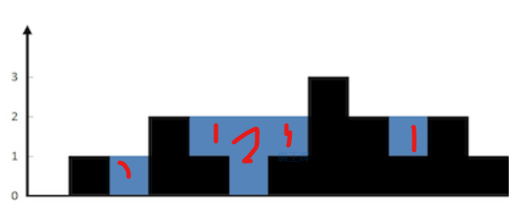

## 巧妙的面积法


```python
class Solution:
    def trap(self, height: List[int]) -> int:
        ans = 0
        h1 = 0
        h2 = 0
        for i in range(len(height)):
            h1 = max(h1,height[i])
            h2 = max(h2,height[-i-1])
            ans = ans + h1 + h2 -height[i]
        return  ans - len(height)*h1 ##减去整体面积

```
## 暴力法

我们遍历每个下标，寻找它左边和右边最高的柱子，判断是否可以接到水，将可接水的结果累加即可。




```python
class Solution:
    def trap(self, height: List[int]) -> int:
        ans = 0
        for i in range(len(height)):
            max_left, max_right = 0,0
            # 寻找 max_left
            for j in range(0,i):
                max_left = max(max_left,height[j])
            # 寻找 max_right
            for j in range(i,len(height)):
                max_right = max(max_right,height[j])
            if min(max_left,max_right) > height[i]:
                ans += min(max_left,max_right) - height[i]
        
        return ans
```

## 动态规划

```python
class Solution:
    def trap(self, height: List[int]) -> int:
        # 边界条件
        if not height: return 0
        n = len(height)
        maxleft = [0] * n
        maxright = [0] * n
        ans = 0
        # 初始化
        maxleft[0] = height[0]
        maxright[n-1] = height[n-1]
        # 设置备忘录，分别存储左边和右边最高的柱子高度
        for i in range(1,n):
            maxleft[i] = max(height[i],maxleft[i-1])
        for j in range(n-2,-1,-1):
            maxright[j] = max(height[j],maxright[j+1])
        # 一趟遍历，比较每个位置可以存储多少水
        for i in range(n):
            if min(maxleft[i],maxright[i]) > height[i]:
                ans += min(maxleft[i],maxright[i]) - height[i]
        return ans


```

