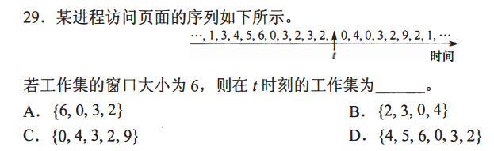

CPU 负责 保存断点和程序状态字

+ 操作系统保存通用寄存器

​    ==  主要区分中断前还是中断后==

  进程处于临界区可以处理机调度

临界资源=互斥+共享

PV进程同步.初值不一定是零

==不同线程需要同步，同一线程不需要同步==

+ 不同进程间无互斥关系，相同进程间各线程需要互斥
+ 全局变量需要互斥，局部变量无互斥关系
+ 一读一写和两个都为写为互斥
+ 对满足上述要求每一变量均需加互斥变量

共享设备是一段时间允许多个进程同时访问的设备

地址映射和中断系统需要专门硬件配合

同步（直接相互制约关系）：。若期望的消息尚未产生，则对应的初值应设为0；若期望的消息已经存在，则信号量应设为一个非0的正整数。
互斥（间接相互制约关系）：互斥信号量的初值为1。

50.A。当进程被唤醒时，它从阻塞状态变为就绪状态，即可以重新占用CPU(但不是直接占用CPU,区别于运行状态)。

各个线程拥有属于自己的栈空间，不允许共享。

设备分配不会引起进程调度

```

时间=查表+访问、
快表一次快表一次访问内存
一级页表两次访问内存
二级页表三次访问内存

```




虚拟存储器是通过采用请求调页系统的方法在逻辑上扩充内存，允许将一个程序分成多
次调入内存，将程序的一部分载入内存就可以开始执行。如果采用这种连续分配技术，就需
要为程序预留足够的内存空间，从而无法达到在逻辑上扩大内存容量的目的，因此只能基于
非连续分配。公众号：羽中知小易，免费分享
虚拟存储容量仅与系统的地址结构有关系，与内外存容量均没有关系。简单点说，即使
内外存固定不变，只要系统地址位数增多，虚拟存储容量就会随之变大。


回收空闲区后，算法会对空闲分区链按分区大小从小到大进行排序

144ms
顺序存取文件是按其在文件中的逻辑顺序依次存取的

多级目录解决命名冲突

索引表而增加了存储空间的开销

24.B。连续分配（顺序文件）具有随机存取功能，但不便于文件长度的动态增长。链
接分配便于文件长度的动态增长，但不具有随机存取功能。索引分配既具有随机存取功能，
也便于文件长度动态增长。

一个文件对应一个索引结点\#绿帽剪辑

对文件的访问只需要通过路径名

磁盘高速缓存在内存

缓冲区在内存

最多创建文件个数=最多索引结点个数 4字节存放索引节点号 32位 $2^{32}$个文件

9.B。SPOOLing是操作系统中采用的一种将独占设备改造成共享设备的技术，通过这
种技术处理后的设备叫作虚拟设备。代替独占设备的部分是共享设备。

6.A。对外设的控制常分为设备、控制器和通道3个层次，所以I/O交通管制程序的主
要功能是管理这3个层次的状态信息。其实通过分析选项也可以得到答案，IO交通管制程序

一台物理设备。所以在SPOOLing系统中并不是将物理设备分配给用户进程，分配到的仅仅
是虚拟设备，也就是内存的一片区域。

磁盘扇区的划分是在磁盘的物理格式化操作中完成的

读写 生产者消费者effe

C。【解析】本题考查中断方式的原理。中断周期中关中断是由隐指令完成，而不是关中断指令，
I错误。最后一条指令是中断返回指令，I错误。CPU通过I/O指令来控制通道，III错误

本题考查DMA方式。每传输一个数据块就要向CPU发出中断请求

在可变分区的地址映射时，通过与基址寄存器拼接可以得到起始物理地址，通过限长寄存器
来判断所需的空间是否能满足。

连续分配：对大小两个文件都只需在文件控制块FCB中设二项，一是首块物理块块号，
二是文件总块数，不需专用块来记录文件的物理地址。
链接分配：对大小两个文件都只需在文件控制块FCB中设二项，一是首块物理块块号，
二是文件最后一个物理块号：同时在文件的每个物理块中设置存放下一个块号的指针。

S.value<=0 ,唤醒一个阻塞队列进程

S.value>0,系统不做额外操作
