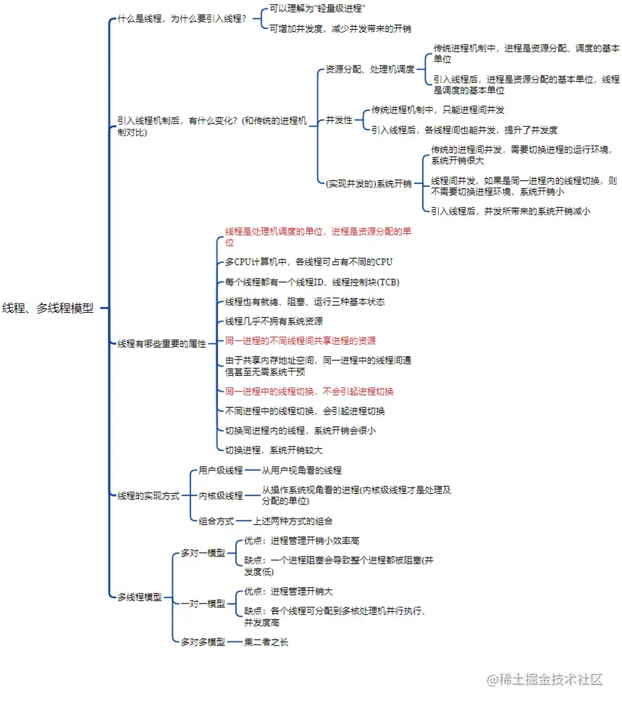
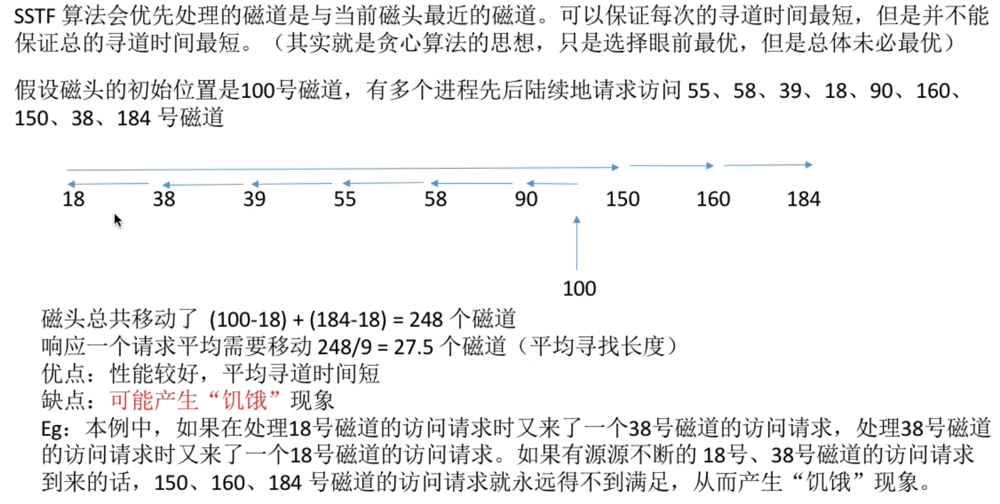

[TOC]


# 
## 系统调用 
### ==系统调用概念与机制==
+ **系统调用概念**：操作系统需要向上提供一些接口，其中供应用程序使用的叫做程序接口，也叫系统调用。具体来讲，系统调用可以理解为一种可供应用程序调用的特殊函数，应用程序可以通过系统调用来请求获得操作系统内核的服务。


+ 系统调用机制

  

+ **系统调用过程：如下，注意发出系统调用请求是在用户态下，而对系统调用的处理则在核心态下**

1. 传递**系统调用参数**

2. 执行**陷入指令**（是在**用户态**下执行的，执行后会立即引发一个**内中断**，使CPU进入**核心态**）

3. 转到**系统调用入口程序**执行

4. 返回应用程序

   


### ==常用文件与进程相关的系统调用（POSIX）==


+ **进程管理** 

  fork调用的一个奇妙之处就是它仅仅被调用一次，却能够返回两次，它可能有三种不同的返回值：
    1）在父进程中，fork返回新创建子进程的进程ID；
    2）在子进程中，fork返回0；
    3）如果出现错误，fork返回一个负值；

     这里有三个点非常关键:

  P：父进程  Q:子进程

  1、P执行了所有程序，而Q只执行了Part. B，即fork()后面的程序。（这是因为Q继承了P的PC-程序计数器）

   2、Q继承了fork()语句执行时当前的环境，而不是程序的初始环境。

   3、P中fork()语句启动子进程Q，并将Q的PID返回，而Q中的fork()语句不启动新进程，仅将0返回。
  
+ **文件管理**

  

## 操作系统结构 

### ==操作系统结构==

### ==微内核==

**微内核 ：只把中断、原语、进程通信等最核心的功能放入内核。进程管理、文件管理和设备管理等功能以用户进程的形式运行在核心态**


- 互调用**，只能通过内核的\*\*“消息传递”\*\*来间接通信

+ 足够小的内核
+ 基于客服/服务器模式
+ 应用机制和策略分离原理
+ 采用面向对象技术

### ==虚拟机==

## 进程与线程

### ==单道程序==

1. 资源独占性
任何时候，位于内存中的程序可以使用系统中的一切资源，不可能有其他程序与之竞争
2. 执行的顺序性
内存中只有一个程序，各个程序是按次序执行的。在做完一个程序的过程中，不可能夹杂进另一个程序执行
3. 结果的可再现性
只要执行环境和初始条件相同，重复执行一个程序，获得的结果总是一样的
4. 运行结果的无关性
程序的运行结果与程序执行的速度无关。系统中的作业以串行的方式被处理，无法提高CPU、内存的利用率
### ==多道程序==

+ 特征

1）多道：即计算机内存中同时存放几道相互独立的程序。

2）宏观上并行：同时进入系统的几道程序都处于运行过程中，即它们先后开始了各自的运行，但都未运行完毕。

3）微观上串行：从微观上看，内存中的多道程序轮流地或分时地占有CPU。

+ 优点

提高CPU的利用率。在多道程序环境下，多个程序共享计算机资源当某个程序等待I/O操作时，CPU可以执行其他程序，大大提高CPU的利用率。

提高设备的利用率。在多道程序环境下，多个程序共享系统的设备，大大提高系统设备的利用率。

提高系统的[吞吐量](https://baike.baidu.com/item/吞吐量?fromModule=lemma_inlink)。在多道程序环境下，减少了程序的等待时间，提高了系统的吞吐量。

### ==运行态、就绪态、阻塞态、新建态、僵死态==


 **注意**单核处理机环境下，每一时刻最多只有一个进程处于运行态。双核环境下可以同时有两个进程处于运行态。


### ==进程、进程模型、进程控制块 (PCB)==


### ==线程、线程模型==



### ==陷入、抢占==

**陷入**：CPU主动跳转，比如断点调试和trap指令。使程序主动进入某一条指令流。
**抢占**(Preemption)是指内核强行切换正在CPU上运行的进程，在抢占的过程中并不需要得到进程的配合，在随后的某个时刻被抢占的进程还可以恢复运行。
发生抢占的原因主要有：1. 进程的时间片用完了，或者 2. 优先级更高的进程来争夺CPU了。

### ==FCFS进程调度、最短进程优先调度、时间片轮转调度、最短进程优先调度、两级调度==

FCFS有利于CPU繁忙，不利于IO繁忙 FCFS是非抢占的


CPU主要的**两级调度**是(作业调度)(进程调度). 首先是作业调度，它把选中的一批作业放人内存，并分配其它必要资源，为这些作业建立相应的进程。然后进程调度按一定的算法从就绪进程中选出一个合适进程，使之在CPU上运行

### ==饿死==

产生饥饿的主要原因是：在一个动态系统中，对于每类系统资源，操作系统需要确定一个分配策略，当多个进程同时申请某类资源时，由分配策略确定资源分配给进程的次序。有时资源分配策略可能是不公平的，即不能保证等待时间上界的存在 。在这种情况下，即使系统没有发生死锁，某些进程也可能会长时间等待．当等待时间给进程推进和响应带来明显影响时，称发生了进程饥饿，当饥饿到一定程度的进程所赋予的任务即使完成也不再具有实际意义时称该进程被饿死。

举个例子，当有多个进程需要打印文件时，如果系统分配打印机的策略是最短文件优先，那么长文件的打印任务将由于短文件的源源不断到来而被无限期推迟，导致最终的饥饿甚至饿死。

**最短进程优先调度 时间片轮转调度 最短进程优先调度 会导致 饥饿**

### ==同步、互斥竞争条件==


+ 计算机运行过程中，并发、无序、大量的进程在使用有限、独占、不可抢占的资源，由于进程无限，资源有限，产生矛盾，这种矛盾称为**竞争**（Race）。

+ 由于两个或者多个进程竞争使用不能被同时访问的资源，使得这些进程有可能因为时间上推进的先后原因而出现问题，这叫做**竞争条件**（Race Condition）。

+ 竞争条件分为两类:
  -Mutex（互斥）：两个或多个进程彼此之间没有内在的制约关系，但是由于要抢占使用某个临界资源（不能被多个进程同时使用的资源，如打印机，变量）而产生制约关系。
  -Synchronization（同步）：两个或多个进程彼此之间存在内在的制约关系（前一个进程执行完，其他的进程才能执行），如严格轮转法。

+ 解决互斥方法：
  Busy Waiting(忙等待)：等着但是不停的检查测试，不睡觉，知道能进行为止
  Sleep and Wakeup(睡眠与唤醒)：引入Semapgore(信号量，包含整数和等待队列,为进程睡觉而设置)，唤醒由其他进程引发。

------------------------------------------------


###  ==临界区==

+ 临界资源
  概念：一次仅允许一个进程使用的共享资源。
+ 临界区
  概念：每个进程中访问临界资源的那段**程序**称之为临界区。
  临界区不是内核对象，而是系统提供的一种数据结构，程序中可以声明一个该类型的变量，之后用它来实现对资源的互斥访问。当欲访问某一临界资源时，先将该临界区加锁（若临界区不空闲则等待），用完该资源后，将临界区释放。
  补充（待定）：分类：临界区也是代码的称呼，所以一个进程可能有多个临界区，分别用来访问不同的临界资源。
  内核程序临界资源：系统时钟
  普通临界资源：普通I/O设备，如打印机（进程访问这些资源的时候，很慢，会自动阻塞，等待资源使用完成）
+ 进程进入临界区的调度原则
  ① 如果有若干进程请求进入空闲的临界区（空闲即0进程访问），一次仅允许一个进程进入。
  ② 任何时候，处于临界区内的进程不可多于一个（0 或 1），若已有进程进入自己的临界区，则其它想进入自己临界区的进程必须等待。
  ③ 进行临界区的进程要在有限时间内退出，以便其它进程能及时进入自己的临界区。
  ④ 如果其它进程不能进入自己的临界区，则应让出 CPU，避免进程出现 “忙等” 现象。


### ==忙等算法、锁变量==

+ **屏蔽中断**，cpu将不会切换到其他进程。但不适合多核系统，而且把屏蔽中断的权利交给用户进程是不明智的。

+ 

+ **锁变量**，初始为0，有进程想进入临界区时，先对锁变量测试，为0则进，进入后将其设为1。0表示临界区没进程，1代表已有进程进入临界区。但是仍存在问题，当进程a把锁变量设为1之前恰好又有进程b进入临界区，临界区将有2个进程。

+  ==严格轮换法==(单标志法)

  忙等待：连续测试一个变量直到某个值出现为止，称为忙等待。

  自旋锁：用于忙等待的锁成为自旋锁。

  原理：

  turn变量初始为0，进程0进入临界区，进程1忙等待，直到进程0离开临界区，并将turn设为1，然后进程1进入临界区，当进程1也离开临界区时，又把turn设为0，接着进程0再次进入临界区，以此类推。由于这种方法需要两者交替进行，如果进程0退出临界区时，turn设为1，但是进程1一直在处理非临界区的工作，进程0只有一直忙等待，直到进程1将turn设为0。这说明，在一个进程比另一个进程慢很多的情况下，轮流进入临界区不是好方法。

  ```c
  while(true){
  	while(turn!=0);
  	critical_region();
  	turn=1;
  	noncritical_region();
  }
  /
  while(true){
  	while(turn!=1);
  	critical_region();
  	turn=0;
  	noncritical_region();
  ```
+ peterson解法


+ TSL指令（测试并加锁）

  

​                                                                                                                                                                                                                                                                                                                                     

一个替代TSL指令是XCHG指令，原子性的交换两个位置的内容。本质上和TSL解法一样。

-------------------------
peterson，TSL或XCHG都是正确的，但是它们都有忙等待的缺点：

1 浪费cpu时间

2 优先级反转问题：例如H进程优先级高，L进程优先级低 ，假设L处于临界区中，H这时转到就绪态想进入临界区，H需要忙等待直到L退出临界区，但是H就绪时L不能调度，L由于不能调度无法退出临界区，所以H永远等待下去。 

### ==原子操作、信号量==


+ **用信号量实现进程互斥、同步、前驱关系**


+ 生产者-消费者问题

  + 生产者 -> 缓冲区 -> 消费者
  有界缓冲区的生产者-消费者问题描述
   一个或多个生产者在生成数据后放在一个缓冲区里
   单个消费者从缓冲区取出数据处理
   任何时刻只能有一个生产者或消费者可访问缓冲区

  + 问题分析
     任何时刻只能有一个线程操作缓冲区（互斥访问）
     缓冲区空时，消费者必须等待生产者（条件同步）
     缓冲区满时，生产者必须等待消费者（条件同步）

  

**实现互斥的P操作一定要在实现同步的P操作之后  (生产满时会导致不能消费)**


### ==管程==


### ==消息==


### ==经典IPC问题==

+ **哲学家就餐问题**

  + **方法一**：至多只允许四位哲学家同时去拿左筷子，最终能保证至少有一位哲学家能进餐，并在用完后释放两只筷子供他人使用。

    设置一个初值为 4 的信号量 r，只允许 4 个哲学家同时去拿左筷子，这样就能保证至少有一个哲学家可以就餐，不会出现饿死和死锁的现象。

    原理：至多只允许四个哲学家同时进餐，以保证至少有一个哲学家能够进餐，最终总会释放出他所使用过的两支筷子，从而可使更多的哲学家进餐。

    

  + **方法二**：仅当哲学家的左右手筷子都拿起时才允许进餐。

    解法 1：利用 AND 型信号量机制实现。

    原理：多个临界资源，要么全部分配，要么一个都不分配，因此不会出现死锁的情形。

    

    解法 2：利用信号量的保护机制实现。

    原理：通过互斥信号量 mutex 对 eat() 之前取左侧和右侧筷子的操作进行保护，可以防止死锁的出现。

    

  + **方法三**：规定奇数号哲学家先拿左筷子再拿右筷子，而偶数号哲学家相反。

  + 

+ 磁盘扇区的划分是在磁盘的物理格式化操作中完成的

    首先对于上述问题进行抽象：**读者和写者是互斥的，写者和写者是互斥的，读者和读者不互斥**；两类进程，一种是写者，另一种是读者。写者很好实现，因为它和其他任何进程都是互斥的，**因此对每一个写者进程都给一个互斥信号量的P、V操作即可**；而读者进程的问题就较为复杂，它与写者进程是互斥的，而又与其他的读者进程是同步的，因此不能简单的利用P、V操作解决
    
    + 读写公平法
```C
  int count = 0;
  信号量 queue = 1; // 实现“读写公平”的互斥锁，可以视为一个队列
  信号量 busy = 1; // “读文件”和“写文件”的互斥锁
  信号量 mutex = 1; // 变量 count 的互斥锁

  Reader(){ // 读者进程
      while(1){
          P(queue); // 在无写进程请求时不需要进入队列
          P(mutex); // 该互斥量实际上是多余的，上面语句已经兼有互斥功能
          count++; 
          if (count == 1){ 
              P(busy);
          }
          V(mutex); // 该互斥量实际上是多余的，下面语句已经兼有互斥功能
          V(queue); // 恢复对共享文件的访问
                               
          读文件; 
               
          P(mutex);
          count--; 
          if (count == 0){ 
              V(busy);
          }
          V(mutex);
      }
  }

  Writer(){ // 写者进程
      while(1){
          P(queue); // 在无其他写进程请求时不需要进入队列
          P(busy);
          写文件;
          V(busy);
          V(queue); // 恢复对共享文件的访问
      }
  }

```

  速记：PPCPVVPCVV  PPVV 实现互斥的P操作一定要在实现同步的P操作之后


## I/O

### ==I/O 的各种控制方式==


[I/O控制方式（全网最细） - 知乎 (zhihu.com)](https://zhuanlan.zhihu.com/p/139505392)

### ==设备驱动程序==

[(24条消息) 设备驱动程序_设备驱动程序的执行过程_cany1000的博客-CSDN博客](https://blog.csdn.net/dongyanxia1000/article/details/51878467)

### ==SPOOLing==


### ==RAM盘==

### ==磁盘==

### 

###   ==磁盘调度算法==

### 
寻道时间与另外两个时间相比占主导地位

+ 先来先服务FCFS

  

+ 最短寻道优先SSF/SSTF

  

+ 电梯算法(扫描算法)

  
###  ==时钟==

+ 时钟(clock) 又称为定时器(timer)， 由于各种各样的原因决定了它对于任何多道程序设计系统的操作都是至关重要的。时钟负责维护时间，并且防止一个进程垄断CPU。

**时钟硬件**

+ 比较简单的时钟被连接到110V或220V的电源线上，这样每个电压周期产生一个中断，频率是50Hz或60Hz。

+ 另一种类型的时钟由三个部件构成: 晶体振荡器、计数器和存储寄存器。当把一块石英晶体适当地切割并且安装在一定的电压之下时，它就可以产生非常精确的周期性信号，典型的频率范围是几百兆赫兹，具体的频率值与所选的晶体有关。

+ 可编程时钟通常具有几种操作模式。在**一次完成模式**(one-shot mode)下，当时钟启动时，它把存储寄存器的值复制到计数器中，然后，来自晶体的每一个脉冲使计数器减1。当计数器变为0时，产生一个中断，并停止工作，直到软件再一次显式地启动它。

+ 在**方波模式**(square-wave mode)下，当计数器变为0并且产生中断之后，存储寄存器的值自动复制到计数器中，并且**整个过程无限期地再次重复下去**。这些**周期性的中断称为时钟滴答(clock tick)**。

+ 为了防止计算机的电源被切断时丢失当前时间，大多数计算机具有一个由电池供电的备份时钟。

**时钟软件**

+ 时钟的第一个功能是维持**正确的日时间**，也称为实际时间(real time), 这并不难实现，只需要如前面提到的那样在每个时钟滴答将计数器加1即可。唯一要当心的事情是日时间计数器的位数，对于一个频率为60Hz的时钟来说，32位的计数器仅仅超过2年就会溢出。很显然，系统不可能在32位寄存器中按照自1970年1月1日以来的时钟滴答数来保存实际时间。

+ 可以采取三种方法来解决这一问题：

  1. 第一种方法是使用一个**64位的计数器**，但这样做会使维护计数器的代价变得很高，因为1秒内需要做很多次维护计数器的工作。

  2. 第二种方法是**以秒为单位维护日时间**，而不是以时钟滴答为单位，该方法使用一个**辅助计数器**来对时钟滴答计数，直到累计至完整的一秒。因为2^32秒超过了136年，所以该方法可以工作到22世纪。

  3. 第三种方法是对**时钟滴答计数**，但是这一计数工作是相对于系统引导的时间，而不是相对于一个固定的外部时间。当读入备份时钟或者用户输入实际时间时，系统引导时间就从当前日时间开始计算，并且以任何方便的形式存放在内存中。以后，当请求日时间时，将存储的日时间值加到计数器上就可以得到当前的日时间。

+ 时钟的第二个功能是防止**进程超时运行**。每当启动一个进程时，调度程序就将一个计数器初始化为以时钟滴答为单位的该进程时间片的取值。每次时钟中断时，时钟驱动程序将时间片计数器减1。当计数器变为0时，时钟驱动程序调用调度程序以激活另一个进程。

+ 时钟的第三个功能是**CPU记账**。最精确的记账方法是，每当一个进程启动时，便启动一个不同于主系统定时器的辅助定时器。当进程终止时，读出这个定时器的值就可以知道该进程运行了多长时间。为了正确地记账，当中断发生时应该将辅助定时器保存起来，中断结束后再将其恢复。

+ 在许多系统中，进程可以请求操作系统在一定的时间间隔之后向它报警。警报通常是信号、中断、消息或者类似的东西。

+ 如果时钟驱动程序拥有足够的时钟，它就可以为每个请求设置一个单独的时钟。如果不是这样的情况，它就必须用一个物理时钟来**模拟多个虚拟时钟**。一种方法是维护一张表，将所有未完成的定时器的信号时刻记入表中，还要维护一个变量给出下一个信号的时刻。每当日时间更新时，时钟驱动程序进行检查以了解最近的信号是否已经发生。如果是的话，则在表中搜索下一个要发生的信号的时刻。

+ 注意在时钟中断期间，时钟驱动程序要做几件事情——将实际时间增1, 将时间片减1并检查它是否为0，对CPU记账，以及将报警计数器减1。

+ 操作系统的组成部分也需要设置定时器，这些定时器被称为**监视定时器(**watchdog timer)，并且经常用来检测死机之类的问题(特别是在嵌入式设备中)。例如，监视定时器可以用来对停止运行的系统进行复位。在系统运行时，它会定期复位定时器，所以定时器永远不会过期。既然如此，定时器过期则证明系统已经很长时间没有运行了，这就会导致纠正的行动一-例如全系统复位。

**软定时器**

+ 一般而言， 有两种方法管理I/O: **中断和轮询**。 中断具有较低的响应时间 (latency)，中断具有相当大的开销。
  替代中断的是让应用程序对它本身期待的事件进行轮询。这样做避免了中断，但是可能存在**相当长的等待时间**。
  
+ 对于某些应用而言，中断的开销和轮询的等待时间都是不能接受的。

+ **软定时器(soft timer) 避免了中断**。无论何时当内核因某种其他原因在运行时，在它返回到用户态之前，它都要检查实时时钟以了解软定时器是否到期。如果这个定时器已经到期，则执行被调度的事件(例如，传送数据包或者检查到来的数据包)，而**无需切换到内核态**，因为系统已经在内核态。在完成工作之后，软定时器被复位以便再次闹响。要做的全部工作是将当前时钟值复制给定时器并且将超时间隔加上。

### ==终端设备==
键盘、鼠标、监视器


## ==死锁== 


### ==死锁预防==


### ==死锁检测==


### ==死锁避免、银行家算法==

+ 安全状态:如果存在一个由系统中所有进程构成的安全序列P1，…，Pn，则系统处于安全状态。安全状态一定是没有死锁发
+ 不安全状态:不存在一个安全序列。不安全状态不一定导致死锁。


### ==两阶段加锁==

**定义：事务必须严格分为两个阶段对数据进行加锁和解锁的操作，第一阶段加锁，第二阶段解锁。**

第一阶段：进程试图对所有所需的记录进行加锁，一次锁一个记录。若第一阶段加锁成功，就开始第二阶段，完成更新然后释放锁。

**也就是说一个事务中一旦释放了锁，就不能再申请新锁了**

若在第一阶段某个进程需要的记录已被加锁，则该进程释放它所有加锁的记录，然后重新开始第一阶段。


## 内存管理


### ==交换、虚拟存储器==


虚拟存储技术和交换技术很像，乍一看都是换入换出，把暂时不需要用的数据换出内存，将需要用到的数据换入内存，从而实现逻辑上内存的扩充。二者之间的区别是，虚拟存储技术是在一个作业运行的过程中，将作业的数据进行换入换出。王道老师举得例子就是玩儿游戏。这儿换一个游戏，比如玩儿DOTA，停留在场景A的时候，场景B的数据不需要用到，所以不放在内存，转换到场景B的时候再把场景B的数据放入内存。而交换技术是内存紧张时，换出某些进程，腾出内存空间，换入其他进程。换而言之，交换技术是在不同的进程（作业）间的，虚拟存储技术是在一个作业间的。另外提一嘴，覆盖技术也是在同一个程序或进程中的。

引用一个大哥的话，“交换技术是以进程为单位，若进程所需内存大于系统内存 ，则此进程无法进行。而虚拟存储是以页或段为单位，是把进程再分为页或段对内存进行分化，若进程所需内存大于系统内存，进程也可以运行，因为该进程的一部分可换到外存上”，这个总结的挺好的。
### ==地址重定位、地址映射、逻辑地址、物理地址==


### ==固定分区、可变分区（动态分区)==


### ==内碎片、外碎片==

【外部碎片】
外部碎片指的是还没有被分配出去（不属于任何进程），但由于太小了无法分配给申请内存空间的新进程的内存空闲区域。

外部碎片是出于任何已分配区域或页面外部的空闲存储块。这些存储块的总和可以满足当前申请的长度要求，但是由于它们的地址不连续或其他原因，使得系统无法满足当前申请。

多道可变连续分配只有外部碎片。

【内部碎片】
内部碎片就是已经被分配出去（能明确指出属于哪个进程）却不能被利用的内存空间；

内部碎片是处于区域内部或页面内部的存储块。占有这些区域或页面的进程并不使用这个存储块。而在进程占有这块存储块时，系统无法利用它。直到进程释放它，或进程结束时，系统才有可能利用这个存储块。

```
单道连续分配只有内部碎片。多道固定连续分配既有内部碎片，又有外部碎片。
不会产生内部碎片的存储管理是：分段式存储管理。
按需分配没有内碎片，例如：动态分区分配、分段存储管理
固定分配没有外碎片，例如：固定分区分配、分页存储管
```

### 动态分区分配算法：==首次适配法、下次适配法、最佳适配法、最差适配法==


### ==分页、分段==

+ 分页式存储管理
分页存储管理是将一个进程的逻辑地址空间分成若干个大小相等的片，称为页面或页，并为各页加以编号，从0开始，如第0页、第1页等。
相应地，也把内存空间分成与页面相同大小的若干个存储块，称为(物理)块或页框(frame)，也同样为它们加以编号，如0#块、1#块等等。在为进程分配内存时，以块为单位将进程中的若干个页分别装入到多个可以不相邻接的物理块中。由于进程的最后一页经常装不满一块而形成了不可利用的碎片，称之为“页内碎片”。

+ 分段式存储管理
引入分段存储管理方式的目的，则主要是为了满足用户（程序员）在编程和使用上多方面的要求。。
在分段存储管理方式中，作业的地址空间被划分为若干个段，每个段定义了一组逻辑信息。例如，有主程序段MAIN、子程序段X、数据段D及栈段S等。每个段都有自己的名字。为了实现简单起见，通常可用一个段号来代替段名，每个段都从0开始编址，并采用一段连续的地址空间。段的长度由相应的逻辑信息组的长度决定，因而各段长度不等。整个作业的地址空间由于是分成多个段，因而是二维的，亦即，其逻辑地址由段号(段名)和段内地址所组成。

### ==页表、页表项、虚页、页框==

**页**：分页存储管理将进程的逻辑地址空间划分为若干页（面），并且对其编号，号数从0开始，每个页（面）的大小称为页面大小，且大小应为2的幂。`进程的块`
用于存放页的地址空间就可以写为

页号| 页内地址(或叫位移量）  
:-:|:-:  

**页框(物理页)：**把可用的**物理内存**也划分为同样大小的连续的部分，称为块或页框。`内存的块`
**页表：**又称页面映像表，存储在内存中，通过页表建立页（面）与物理块的索引。
**页表项：**在页表中，一个页号与其对应的物理块号称之为一个页表项（由已知条件知道大小是32位）。 `页号是隐含的、高速缓存禁止位、修改位、访问位、保护位、有效位(在/不在位)`
每个页表项的结构为：

页号| 物理块号  
---|---  


```
页面大小 = 2^（页内地址位数）  
页数 =页号数=页表项的数目
```

### ==多级页表、逆向页表==

解决需要大容量页表的最好方法是：把页表页看成普通的文件，对它进行离散分配，即对页表再分页，由此形成多级页表的思想。

外层页面大小 = 内层页面大小


外层页号| 外层页n| ……| 外层页3| 外层页2| 外层页1| 内层页  
---|---|---|---|---|---|---  


使用反置页表的话，所有进程共同使用一张页表，这张页表中的条目的数量和内存中物理的页框的数量是一样的。


### ==TLBs，翻译后援存储器（快表）==
快表解决了两次访问内存的问题，降低系统的开销
在地址变换结构中增加一个具有并行查找能力的特殊的高速缓冲寄存器，这种设备称为转换检测缓冲区，又称为快表，用于存放当前访问过的页表项。此时，当给出一个有效地址时，地址变换机构首先通过将该页号p同TLB中的所有表项同时进行比较，判断该表是否在其中，如果发现可匹配的页面，则直接取出其页表项得到物理块号，而不必通过页表。如果地址变换机构没有可匹配的项，就进行正常的页表查询。首先从TLB中淘汰一个表项，然后用新找到的页表项替换它。这样，如果这一页很快再次被访问，那么第二次自然将会命中。
因为寄存器的价格原因，快表的结构不可能很大，通常能存放16 - 512个页表项，这对中小型作业来说，有可能把全部页表放入快表中，对于大型作业，可以将常用的页表项放入其中。由于程序的局部性原则，快表的引入极大改善了系统的效率，数据显示，从快表中查找到页表项的概率可以达到90%。这样因为访问快表而访问内存的次数就会大大减少，从而降低系统的开销。

```
【解析】本题考查快表和慢表的关系。快表又称TLB,采用高速相联存储器来存储可能需要使用的页的对应表项；而慢表存储在内存中。快表采用的是相联存储器，它的速度快来源于硬件本身，而不是依赖搜索算法来查找的，慢表通常是依赖于查找算法。快表与慢表的命中率没有必然联系，快表仅是慢表的一个部分拷贝，不能够得到比慢表更多的结果，因此C选项错误。
```


### 页面置换算法：==最近未使用页面替换算法（NRU）、先进先出页面替换算法（FIFO）、第二次机会页面替换算法、时钟页面替换算法、最久未使用页面替换算法（LRU）、软件模拟LRU算法 （NFU）、老化算法==
+ 最近未使用页面替换算法（NRU）
R位：访问位；M位：修改位  
+ 先进先出页面替换算法（FIFO）
每次选择淘汰的面是最早进人内存的页而
实现方法．把入内存的页面根据调入的先后顺序排成一个队列，需要换出页向时选择队头页面即可、
队列的最人长度取决于系统为进程分配了多少个内存块。

+ 第二次机会页面替换算法


+ 时钟页面替换算法
1.需要用到页表项当中的访问位，当一个页面被装入内存时，把该位初始化为0。然后如果这个页面被访问（读/写），则把该位置置1。
2.把各个页面组织形成环形链表（类似钟表面），把指针指向最老的页面（最先进来）。
3.当发生一个缺页中断时，考察指针所指向的最老页面。若它的访问位为0，立即淘汰；若访问位为1，则把该位置为0，然后指针往下移动一格。如此下去，直到找到被淘汰的页面，然后把指针移动到它的下一格。
+ 最久未使用页面替换算法（LRU）
当一个缺页中断发生时，选择最久未使用的那个页面(需要排序)，并淘汰之
需要专门的硬件支持效果比较好，但是系统的开销比较大
+ NFU（Not Frequently Used）：此算法使用一个计数器跟踪每个页面的引用次数。优点是能够较好地反映页面的使用情况，但缺点是可能过于偏重历史使用情况(不忘记任何事情)，忽视当前的页面访问模式。
+ 
+ 老化算法：它是NRU的改进版，使用一个“老化寄存器”记录每个页面的使用历史。优点是能够近似实现LRU，但需要定期更新每个页面的寄存器
+ 

### ==Belady异常、系统抖动==
**Belady现象：**在采用FIFO算法时，有时会出现分配的物理页面数增加，缺页率反而提高的异常现象。
原因：FIFO算法的置换特征与进程访问内存的动态特征是矛盾的，与置换算法的目标是不一致的（即替换较少使用的页面），因此，被它置换出去的页面并不一定是进程不会访问的。

**抖动（颠簸）现象：**刚刚换出的页而马上又要换入内存，刚刚换入的页面马上又要换出外存，这种频繁的页而诡度行为称为抖动，或颠簸。


**原因：**给进程分配的内存空间太小、页面置换算法不合适

### ==工作集模型、工作集==
一个进程当前正在使用的页面的集合称为它的**工作集**


## ==文件系统==

### ==文件==

**定义**

- 概念：文件是以计算机硬盘为载体的存储在计算机上的信息集合。

- 组成形式：

- - 数据项：数据项是文件最低级的数据组成形式，主要可分为基本数据项(用来描述一个对象的某种属性的一个值)、组合数据项(由多个基本对象组成)。
  - 记录：记录是一组相关的数据项之和。
  - 文件： 文件是创建者所对的一组相关信息的集合。

**属性**

- 文件名：一个文件夹下文件名称为一，但是不能唯一确定一个文件
- 标识符：标识文件系统里文件的唯一标识符，可以唯一确定文件
- 类型：文件的分类，比如 .java，.txt文件
- 位置：指向设备上和设备上文件的指针
- 大小：文件当前的大小(字节、字或者块表示)，可能包含文件最大值
- 保护：对文件进行保护的访问控制信息，比如：只读、可读可写、拒绝访问等
- 时间、日期、用户标识符：文件创建、文件修改和上次访问的一些信息，用来保护和跟踪文件使用。

**基本操作**

- 创建文件：create系统调用
- - 系统调用参数：所需要的大小空间、文件存放路径、文件名
  - 系统调用步骤：在外存中找到文件申请的存储空间；系统调用根据文件路径找到该目录对于的目录表，插入目录项

- 删除文件：delete系统调用
- - 系统调用参数：文件路径、文件名
  - 系统调用步骤：根据文件路径找到目录表；根据文件名找到目录项；回收文件占用磁盘块；删除目录项

- 读文件：read系统调用
- - 系统调用参数：文件名、读入多少数据；读入数据放在内存什么位置
  - 系统调用步骤：读文件的时候已经打开文件了；所以进程只用提供文件在打开文件表中的索引号即可；操作系统读出进程指定大小的数据存到进程指定的区域

- 写文件：write系统调用
- - 系统调用参数：文件名、写多少数据、写到什么位置
  - 系统调用步骤：将进程指定文件数据写到指定大小的外存中

- 打开文件：open系统调用
- - 系统调用参数：文件名、文件路径、打开之后对文件的操作
  - 系统调用步骤：根据路径找到目录表；根据文件名找到目录项；根据目录项检查用户是否有操作权限；有的话操作系统会把文件的目录项复制到“打开文件表”(两种，系统文件表：系统记录所有打开的文件；进程文件表：进程记录自己打开的文件)中；用户根据编号打开文件

- 关闭文件：close系统调用
- - 系统调用参数：文件路径、文件名
  - 系统调用步骤：将进程打开文件表中相应表项删除；回收分配给该文件的内存空间；系统打开文件表的计数器count-1，如果count=0，页删除表项

**文件结构**
+ 字节序列
+ 记录序列
+ 树

### ==字符设备文件、块设备文件==

- `块设备` 也叫做块特殊文件，它的行为通常与普通文件相似：它们是字节数组，并且在给定位置读取的值是最后写入该位置的值。来自块设备的数据可以缓存在内存中，并从缓存中读取；写入可以被缓冲。块设备通常是可搜索的，块设备的概念是，相应的硬件可以一次读取或者写入整个块，例如磁盘上的一个扇区
- `字符设备` 也称为字符特殊文件，它的行为类似于管道、串行端口。将字节写入字符设备可能会导致它在屏幕上显示，在串行端口上输出，转换为声音。

### ==目录项、目录文件、i-node、超级块==

inode结构中，几乎囊括了一个文件的所有信息，权限、属性、时间、大小等等。
只要用于管理、控制文件相关信息的数据结构都被称为 FCB，即文件控制块，inode 也是这种结构，因此inode 也是FCB 的一种。注意：inode 是文件在文件系统上的元信息，要通过文件系统获得文件的实体，必须先要找到文件的 inode。

一个文件由目录项、inode 和 数据块 组成：
  - **文件控制块（目录项/FCB）：**用来存放控制文件需要的各种信息的数据结构，以实现“按名存取”。一个FCB就是一个目录项，当创建一个新文件时，系统将分配一个FCB并存放在文件目录中，成为目录项，目录项中包含了**文件名+索引节点（inode）号**(索引节点号是指向索引节点表(system inode table )中对应的索引节点)

      `目录项==FCB`

  - Inode：又称文件索引节点，包含文件的基础信息以及数据块的指针。

    inode 包含文件的元信息，具体来说有以下内容：

    - 模式/权限（保护）
    - 所有者 ID
    - 组 ID
    - 文件大小
    - 文件的硬链接数
    - 上次访问时间
    - 最后修改时间
    - inode 上次修改时间

  - 数据块：包含文件的具体内容。

  - 超级块：

    紧跟在引导块后面的是 `超级块(Superblock)`，超级块 的大小为 4096 字节，从磁盘上的字节偏移 4096 开始。超级块包含文件系统的所有关键参数

    - 文件系统的大小
    - 文件系统中的数据块数
    - 指示文件系统状态的标志
    - 分配组大小

    在计算机启动或者文件系统首次使用时，超级块会被读入内存

  inode 包含文件的元信息，具体来说有以下内容：
  - 文件的字节数。
  - 文件拥有者的 User ID。
  - 文件的 Group ID。
  - 文件的读、写、执行权限。
  - 文件的时间戳，共有三个：ctime 指 inode 上一次变动的时间，mtime 指文件内容上一次变动的时间，atime 指文件上一次打开的时间。
  - 链接数，即有多少文件名指向这个 inode。
  - 文件数据 block 的位置


### ==硬链接、符号链接==


+ 硬链接

一般情况下，文件名和 inode 号码是"一一对应"关系，每个 inode 号码对应一个文件名。但是，Linux 系统允许，多个文件名指向同一个 inode 号码。这意味着，可以用不同的文件名访问同样的内容；对文件内容进行修改，会影响到所有文件名；但是，删除一个文件名，不影响另一个文件名的访问。这种情况就被称为"[硬链接](https://so.csdn.net/so/search?q=硬链接&spm=1001.2101.3001.7020)"（hard link）。

+ 软链接

除了硬链接以外，还有一种特殊情况。文件 A 和文件 B 的 inode 号码虽然不一样，但是文件 A 的内容是文件 B 的路径。读取文件 A 时，系统会自动将访问者导向文件 B。因此，无论打开哪一个文件，最终读取的都是文件 B。这时，文件 A 就称为文件 B 的"[软链接](https://so.csdn.net/so/search?q=软链接&spm=1001.2101.3001.7020)"（soft link）或者"符号链接（symbolic link）。

这意味着，文件 A 依赖于文件 B 而存在，如果删除了文件 B，打开文件 A 就会报错："No such file or directory"。这是软链接与硬链接最大的不同：文件 A 指向文件 B 的文件名，而不是文件 B 的inode 号码，文件 B 的 inode"链接数"不会因此发生变化。

### ==打开文件表==


### ==文件系统安装==

###  ==块高速缓存==

最常用的减少磁盘访问次数的技术是使用 `块高速缓存(block cache)` 或者 `缓冲区高速缓存(buffer cache)`。高速缓存指的是一系列的块，它们在逻辑上属于磁盘，但实际上基于性能的考虑被保存在内存中。

管理高速缓存有不同的算法，常用的算法是：检查全部的读请求，查看在高速缓存中是否有所需要的块。如果存在，可执行读操作而无须访问磁盘。如果检查块不再高速缓存中，那么首先把它读入高速缓存，再复制到所需的地方。之后，对同一个块的请求都通过`高速缓存`来完成。


### ==文件系统的性能==
+ 高速缓存
+ 块提前读
在需要用到块之前，试图提前将其写入高速缓存，从而提高命中率。许多文件都是顺序读取。如果请求文件系统在某个文件中生成块 k，文件系统执行相关操作并且在完成之后，会检查高速缓存，以便确定块 k + 1 是否已经在高速缓存。如果不在，文件系统会为 k + 1 安排一个预读取，因为文件希望在用到该块的时候能够直接从高速缓存中读取。
当然，块提前读取策略只适用于实际顺序读取的文件。对随机访问的文件，提前读丝毫不起作用。甚至还会造成阻碍
+ 减少磁盘臂运动
把有可能顺序访问的块放在一起，当然最好是在同一个柱面上，从而减少磁盘臂的移动次数
+ 磁盘碎片整理


###  ==一致性检查==
影响可靠性的一个因素是文件系统的一致性。许多文件系统读取磁盘块、修改磁盘块、再把它们写回磁盘。如果系统在所有块写入之前崩溃，文件系统就会处于一种`不一致(inconsistent)`的状态。如果某些尚未写回的块是索引节点块，目录块或包含空闲列表的块，则此问题是很严重的。

为了处理文件系统一致性问题，大部分计算机都会有应用程序来检查文件系统的一致性。例如，UNIX 有 `fsck`；Windows 有 `sfc`，每当引导系统时（尤其是在崩溃后），都可以运行该程序。

可以进行两种一致性检查：**块的一致性检查和文件的一致性检查**。为了检查块的一致性，应用程序会建立两张表，每个包含一个计数器的块，最初设置为 0 。第一个表中的计数器跟踪该块在文件中出现的次数，第二张表中的计数器记录每个块在空闲列表、空闲位图中出现的频率。

然后检验程序使用原始设备读取所有的 inode，忽略文件的结构，只返回从零开始的所有磁盘块。从 inode 开始，很容易找到文件中的块数量。每当读取一个块时，该块在第一个表中的计数器 + 1，应用程序会检查空闲块或者位图来找到没有使用的块。空闲列表中块的每次出现都会导致其在第二表中的计数器增加。

如果文件系统一致，则每一个块或者在第一个表计数器为 1，或者在第二个表计数器中为 1，如下图所示


但是当系统崩溃后，这两张表可能如下所示


其中，磁盘块 2 没有出现在任何一张表中，这称为 `块丢失(missing block)`。尽管块丢失不会造成实际的损害，但它的确浪费了磁盘空间，减少了磁盘容量。块丢失的问题很容易解决，文件系统检验程序把他们加到空闲表中即可。

有可能出现的另外一种情况如下所示


其中，块 4 在空闲表中出现了 2 次。这种解决方法也很简单，只要重新建立空闲表即可。

最糟糕的情况是在两个或者多个文件中出现同一个数据块，如下所示


比如上图的磁盘块 5，如果其中一个文件被删除，块 5 会被添加到空闲表中，导致一个块同时处于使用和空闲的两种状态。如果删除这两个文件，那么在空闲表中这个磁盘块会出现两次。

文件系统检验程序采取的处理方法是，先分配一磁盘块，把块 5 中的内容复制到空闲块中，然后把它插入到其中一个文件中。这样文件的内容未改变，虽然这些内容可以肯定是不对的，但至少保证了文件的一致性。这一错误应该报告给用户，由用户检查受检情况。

除了检查每个磁盘块计数的正确性之外，文件系统还会检查目录系统。这时候会用到一张`计数器表`，但这时是一个文件（而不是一个块）对应于一个计数器。程序从根目录开始检验，沿着目录树向下查找，检查文件系统的每个目录。对每个目录中的文件，使其计数 + 1。

> 注意，由于存在硬连接，一个文件可能出现在两个或多个目录中。而遇到符号链接是不计数的，不会对目标文件的计数器 + 1。

在检验程序完成后，会得到一张由 inode 索引的表，说明每个文件和目录的包含关系。检验程序会将这些数字与存储在文件 inode 中的链接数目做对比。如果 inode 节点的链接计数大户目录项个数，这时即使所有文件从目录中删除，这个计数仍然不是 0 ，inode 不会被删除。这种错误不严重，却因为存在不属于任何目录的文件而浪费了磁盘空间。

另一种错误则是潜在的风险。如果同一个文件链接两个目录项，但是 inode 链接计数只为 1，如果删除了任何一个目录项，对应 inode 链接计数变为 0。当 inode 计数为 0 时，文件系统标志 inode 为 `未使用`，并释放全部的块。这会导致其中一个目录指向一未使用的 inode，而很有可能其块马上就被分配给其他文件。

### ==文件系统安全性与保护机制==


 