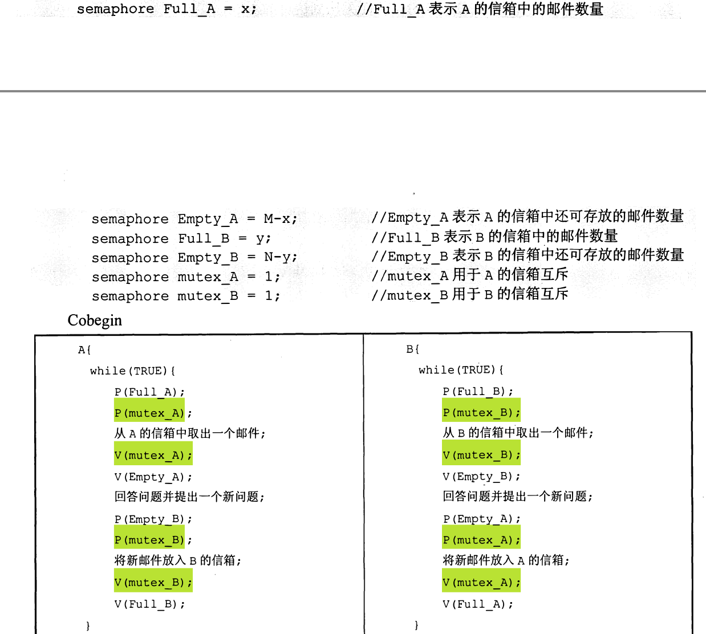

## i/o通道

以下4个步骤在通道过程中的正确顺序是()。
向CPU发出中断请求
启动I/O通道
组织I/O操作
向CPU发出中断请求


## 进程同步

1) 写出每个` Procedure`
2) 确定`Procedure`中的活动的前后顺序==线程间的同步关系==
3) 对每一==同步关系==设定`Semaphore`（一般为1）
4) 先V后P

```
例：设公共汽车上有驾驶员和售票员。驾驶员的活动：启动车辆，正常行车，
到站停车；售票员的活动：关车门，售票，开车门。在汽车不断地到站、停车、行驶的
过程中，这两个活动有什么同步关系？用信号量和 P,V 操作实现它们的同步。
```
```
两个线程
Procedure driver 
Procedure conductor 
两个同步关系
先关车门V后P启动车辆
先到站停车V后P开车门
```

| Semaphore S1=S2=0；                                          |                                                              |
| ------------------------------------------------------------ | ------------------------------------------------------------ |
| Procedure driver {   <br/>while(true) {<br/>P(S1);<br/>启动车辆;<br/>正常行车;<br/>到站停车;<br/>V(S2);<br/>}<br/>} | Procedure conductor {<br/>While(true) {<br/>关车门;<br/>V(S1);<br/>售票;<br/>P(S2);<br/>开车门;<br/>上下乘客;<br/>}<br/>} |

## 11

45.(9分)有A、B两人通过信箱进行辩论，每个人都从自己的信箱中取得对方的问题。将
答案和向对方提出的新问题组成一个邮件放入对方的邮箱中。假设A的信箱最多放M个邮件，B的信箱最多放N个邮件。初始时A的信箱中有x个邮件(0<x<M),B箱中有y个(0<y<N)
辩论者每取出一个邮件，邮件数减1。A和B两人的操作过程描述如下：


当信箱不为空时，辩论者才能从信箱中取邮件，否则需要等待。当信箱不满时，辩论者才能将新邮件放入信箱，否则需要等待。请添加必要的信号量和P、V(或wait、signal)操作，以实现上述过程的同步。要求写出完整过程，并说明信号量的含义和初值。




## 银行家算法

## 逻辑地址转物理地址-页

1. 页面大小及对应的位数

   `(1KB=2^10B)1KB为10位`

2. 依位数划分逻辑地址

   `逻辑地址 0AC5H=000 10|10 1100 0101B，虚页号为 2(00010B)`

3. 逻辑地址转换成物理地址

   

## 页面置换算法

"缺页"指的是在程序运行过程中，当程序访问的内存页面（或称为页）不在物理内存中时，就会发生缺页异常 缺页率

## 文件系统

超级密押卷（二）45，46

2018 46 `簇-间断存储 文件大小和访问顺序`


1)文件系统中所能容纳的磁盘块总数为4TB/1KB=2。要完全表示所有磁盘块，索引项
中的块号最少要占32/8=4B。而索引表区仅采用直接索引结构，故512B的索引表区能容纳
512B/4B=128个索引项。每个索引项对应一个磁盘块，所以该系统可支持的单个文件最大长度
是128×1KB=128KB。

## 磁盘

+ 柱面 盘面 扇区

+ 平均旋转延迟时间 0.5×60×1000÷`7200`=4.17毫秒

+ 平均传输时间 60÷7200÷扇区数=0.01毫秒

  2019 44 `簇号 和  柱面号 磁道号扇区号的转换` 根据数量 十进制

  2021 46 系统启动和安装 磁盘操作的顺序

  

46.(8分)进程P通过系统调用请求从键盘读入一个字符。题目乱序给出6个处理步骤：①将进程
P插入就绪队列；②将进程P插入阻塞队列；③将字符从键盘控制器读入系统缓冲区；④启动中断
处理程序；⑤系统调用返回；⑥用户通过键盘输入字符。

②将进程P插入阻塞队列；⑥用户通过键盘输入字符；④启动中断
处理程序；③将字符从键盘控制器读入系统缓冲区；①将进程
P插入就绪队列；⑤系统调用返回；
