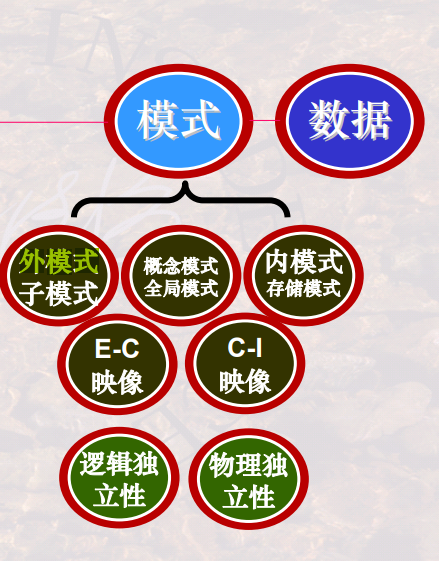

​                                                                                                                                                                                                                                                    

# 华东师大数据学硕824-数据库系统

`参考教材：王珊、萨师煊，《数据库系统概论》第五版，高等教育出版社，2014年（第1-11章）`

---------------------------
[TOC]

-------------------------------------------

## 数据库的基本概念

### 数据库 
(DataBase,DB)

**概念 ：是永久存储在计算机内，有组织、可共享的大量数据的集合**

**特征 ：**

  * **数据按一定的数据模型组织、描述和储存**
  *  **可为各种用户共享**
  *  **冗余度较小**
  *  **数据独立性较高**
  *  **易扩展**

### 数据库管理系统
(DataBase Management System,DBMS)

MYSQL就是一张DBMS

**概念 ：是位于用户与操作系统之间的一层数据管理软件。和操作系统一样是计算机的基础软件**

  * 数据库是一个仓库，但是对数据库的操作是依靠DBMS完成的

**功能 ：**

**1：数据定义功能**

  * 提供 **数据定义语言(DDL)**
  * 定义数据库中的数据对象

**2：数据组织、存储和管理功能**

  * 分类组织、存储和管理各种数据
  * 确定组织数据的文件结构和存取方式
  * 实现数据之间的联系
  * 提供多种存取方法提高存取效率

**3：数据操作功能**

  * 提供 **数据操纵语言(DML)**
  * 实现对数据库的基本操作 (查询、插入、删除和修改)

**4：数据库的事物管理和运行管理**

  * 数据库在建立、运行和维护时由DBMS统一管理和控制
  * 保证数据的安全性、完整性、多用户对数据的并发使用
  * 发生故障后的系统恢复

**5：数据库的建立和维护功能（实用程序）**

  * 数据库初始数据装载转换
  * 数据库转储
  * 介质故障恢复
  * 数据库的重组织
  * 性能监视分析等

其他功能（如通信、数据转换、互访等）

###  DBA

DataBase Administrator

## 数据模型的基本概念
### 层次模型
#### 层次模型的数据结构（二叉树）

在数据库中定义满足下面两个条件的基本层次联系的集合就为层次模型

  * **有且只有一个结点没有双亲结点，此结点为根节点**
  * **根结点以外的所有结点有且只有一个双亲结点**

在层次模型中 **每个结点表示一个记录类型，记录类型之间的联系用结点之间的连线（有向边）表示，这种联系是父子之间的一对多的联系**

例如  

#### 层次模型优缺点（了解）

**优点**

  * 层次模型的数据结构较为简单清晰
  * 层次模型的查询效率高
  * 层次模型提供了良好的完整性支持

**缺点**

  * 层次模型不能很好的表示多对多联系
  * 插入，删除麻烦，编写程序复杂
  * 查询子女结点必须通过双亲结点
  * 由于结构严密，层次命令趋于程序化

### 网状模型

#### 网状模型的数据结构（图）

在数据库中定义满足下面两个条件的基本层次联系的集合就为网状模型

  * **允许一个以上的结点无双亲**
  * **一个结点可以有多于一个的双亲**

例如  

#### 网状模型的优缺点（了解）

**优点**

  * 能够更为直接地描述现实世界
  * 具有良好的性能，存取效率较高

**缺点**

  * 结构复杂，不利于用户掌握
  * 其DDL、DML复杂，嵌入高级语言中也难以让用户掌握
  * 用户需要了解结构细节，加重了编写程序的负担

### 关系模型

#### 关系模型的数据结构

关系不同于上面的两种模型，它是建立在严格的 **数学概念** 上的（更严格的定义在二章给出）。

从 **用户的角度看** ，关系模型由一组 **关系** 组成，每个关系的数据结构是一张 **规范化的二维表**

  
涉及术语如下

**关系 ：一个关系对应一张表**

**元组 ：表中一行或者是一条记录叫做一个元组**

**属性 ：表中一列叫做一个属性，给每一个属性起一个名称叫做属性名**

**码 ：用于唯一确定一个元组**

**域 ：属性的取值范围**

**分量 ：元组的每一个属性值，关系的每一个分量都不可以再分**

**关系模式 ：对关系的描述，必须是规范化的**

  * 关系名（属性1，属性2，… ，属性n）

#### 关系模型的优缺点

**优点**

  * 建立在严格的数学概念的基础上
  * 关系模型的概念单一，无论实体还是联系都用关系表示，对数据的检索和更新结果也是关系。因此简单、清晰，易用
  * 关系模型的存取路径对用户透明

**缺点**

  * 查询效率往往不如格式化数据模型
  * 开发相应数据库管理系统难度大

## 关系模型
### 关系代数

[第2章关系数据库-第四节：关系代数](..\数据库系统\第2章关系数据库-第四节：关系代数.md)

### 关系演算

P57  

GET;PUT插入;HOLD;UPDATA;DELETE;DROP

表示否定(不选) ：$ {\forall}$ ，$\neg\exists$         

表示肯定(选了) ：$\exists$                          

关系演算语言用谓词来表达查询要求，以数理逻辑中的谓词演算为基础

 [关系演算.md](关系演算.md) 

## 查询语言
### SQL（DDL、DML）
### 数据定义语言（DDL）

### 数据操纵语言(DML)

数据操纵语言DML主要有三种形式：

1) 插入：INSERT
2) 更新：UPDATE
3) 删除：DELETE

## 数据库设计
### 数据库模式

### 范式

+ **1NF**:关系中每一分量不可再分

  （关系中任何一列不能再分为两列或更多列）
  **问题原因：非主属性`Sdept`、 `Sloc`部分函数依赖于码**

**解决方法（2NF的处理方法）：进行模式分解，消除部分函数依赖**

+ **2NF**:保证每个非主属性对码都是完全函数依赖

  （一个表中只能保存一种数据，不能把多种数据保存在同一张表中）
  
+  **3NF**:保证每个非主属性对码都是完全函数依赖

  （一个表中只能保存一种数据，不能把多种数据保存在同一张表中
  
+ **BCNF**:BCNF是修正的第三范式，修正了每一属性对候选码的传递依赖

+  **4NF：简单点说，要想满足4NF，那么该关系模式的多值依赖要么是平凡的；如果是非平凡的，就必须退化为函数依赖。也就是说非平凡又非函数依赖的多值依赖是不允许存在的**

  在上面提到的Teaching(C,T,B)显然不是4NF，该关系存在$C \rightarrow T$和 $C \rightarrow B$两个多值依赖，但是都是**非平凡的**，所以需要进行模式分解。分解为他们便是**平凡的**
  
  
  
  $C \rightarrow T$和 $C\rightarrow B$都是平凡多值依赖
  
  #### 规范化小结
  
  规范化的基本思想是**逐步消除数据依赖中不合适的部分，使模式中的各关系模式达到某种程度的“分离”，即“一事一地”的模式设计原则**。让一个关系描述一个概念、一个实体或者实体间的一种联系。若多于一个概念就把它“分离”出去。因此所谓规范化实质上是**概念的单一化**
  
  

### ER图

 [第7章数据库设计-第三节：概念结构设计.md](..\数据库系统\第7章数据库设计-第三节：概念结构设计.md) 

### 逻辑设计

 [第7章数据库设计-第三节：概念结构设计.md](..\数据库系统\第7章数据库设计-第三节：概念结构设计.md) 

### 物理设计

 [第7章数据库设计-第五、六节：物理结构设计和数据库的实施和维护.md](..\数据库系统\第7章数据库设计-第五、六节：物理结构设计和数据库的实施和维护.md) 

### 约束的使用

[（数据库系统概论王珊）第一章绪论-第一节：数据库系统概论.pdf](file://C:/Users/50124/OneDrive - hdu.edu.cn/考研/（数据库系统概论王珊）第一章绪论-第一节：数据库系统概论.pdf)p443

## 事务处理
### ACID属性
#### A：数据库的ACID
##### ①：原子性（Atomicity）

**原子性 ：事务是数据库的逻辑工作单位，事务中包含的诸多操作要么全做、要么不做。因故障未能做完的，需要有一套机制用于“撤销”那一部分已经做了的**

##### ②：一致性（Consistency）

**一致性 ：事务执行的结果必须是使数据库从一个一致性状态变到另一个一致性状态**

  * **一致性状态** ：数据库中只包含 **成功事务** 提交的结果
  * **不一致状态** ：数据库中包含事务 **未完成** 时的状态

例如银行转账业务，账户 A A A转1万元到账户 B B B,该事务包含两个操作：首先是 A A A减少一万元，其次是 B B
B增加一万元，这两个操作要么全部做要么全不做，如果只做其中一个就会发生逻辑错误，数据库就处于不一致状态了

##### ③：隔离性（Isolation）

**隔离性 ：一个事务不能被其他事务干扰。也即一个事务的内部操作及使用的数据对其他并发事务是隔离的，并发执行的各个事务之间不能互相干扰**

比如，下列两个并发执行的事务T1和T2，如按表中所示顺序执行，则事务T1的修改被T2覆盖了，即T2干挠了T1。违背了事务的隔离性，是错误的调度

##### ④：持续性（Durability)

**持续性 ：一个事务一旦提交，它对数据库中数据的改变就是永久性的。接下来的其他操作或故障不应该对其执行结果有任何影响**

#### B：破坏ACID的因素

主要有两类

  * **故障 ：没有执行完；虽然没有完，但是存储介质故障。破坏了ACID中的ACD**
  * **并发干扰 ：多个事务并行运行时，不同事务的操作交叉执行，互相干扰。破坏了ACID中的I**

因此这就是DBMS的 **恢复机制** 和 **并发控制机制** 需要解决的问题

### 事务在程序中的使用方法

各种数据库对事务的支持细节不尽相同，本教程以 MySQL 数据库为例进行讲解，MySQL 使用标准 SQL 来支持事务。

与事务控制有关的 SQL 命令包括：

- BEGIN 或者 START TRANSACTION：开始事务；
- COMMIT：提交事务；
- ROLLBACK：回滚事务；
- SAVEPOINT：在事务内部设置回滚标记点；
- RELEASE SAVEPOINT：删除回滚标记点；
- ROLLBACK TO：将事务回滚到标记点（ROLLBACK 命令的一种变形写法）。

一个事务要么提交（Commit），要么回滚（Rollback），提交意味着成功，回滚意味着失败。编写事务代码时，以 BEGIN 命令开头，后跟一条或者多条 SQL 语句，最后书写 COMMIT 或者 ROLLBACK 命令；COMMIT 和 ROLLBACK 对应事务的两种状态，只能出现一个。

事务控制命令仅能与 DML 类别的 SQL 命令一起使用，包括 INSERT、UPDATE、DELETE 和 SELECT，在创建或者删除表时不能使用事务，因为这些操作在数据库中是自动提交的。

### 并发控制

 [第11章并发控制-第一节：并发控制概述.md](..\数据库系统\第11章并发控制-第一节：并发控制概述.md) 

 [第11章并发控制-第二、三、四节：封锁、封锁协议活锁和死锁.md](..\数据库系统\第11章并发控制-第二、三、四节：封锁、封锁协议活锁和死锁.md) 

 [第11章并发控制-第五、六、七节：并发调度的可串行性、两段锁协议和封锁的粒度.md](..\数据库系统\第11章并发控制-第五、六、七节：并发调度的可串行性、两段锁协议和封锁的粒度.md) 

### 日志、恢复

 [第10章数据库恢复技术-第四、五、六、七节：数据库恢复技术和数据库镜像.md](..\数据库系统\第10章数据库恢复技术-第四、五、六、七节：数据库恢复技术和数据库镜像.md) 

## 数据库的基本工作原理
### 数据的存储方式

### 索引

### 查询的执行方式

 [第9章关系查询处理和关系优化-第一节：查询处理.md](..\数据库系统\第9章关系查询处理和关系优化-第一节：查询处理.md) 

### 查询优化

 [第9章关系查询处理和关系优化-第二节：查询优化.md](..\数据库系统\第9章关系查询处理和关系优化-第二节：查询优化.md) 

 [第9章关系查询处理和关系优化-第三节：查询优化之代数优化.md](..\数据库系统\第9章关系查询处理和关系优化-第三节：查询优化之代数优化.md) 

 [第9章关系查询处理和关系优化-第四节：查询优化之物理优化.md](..\数据库系统\第9章关系查询处理和关系优化-第四节：查询优化之物理优化.md) 

