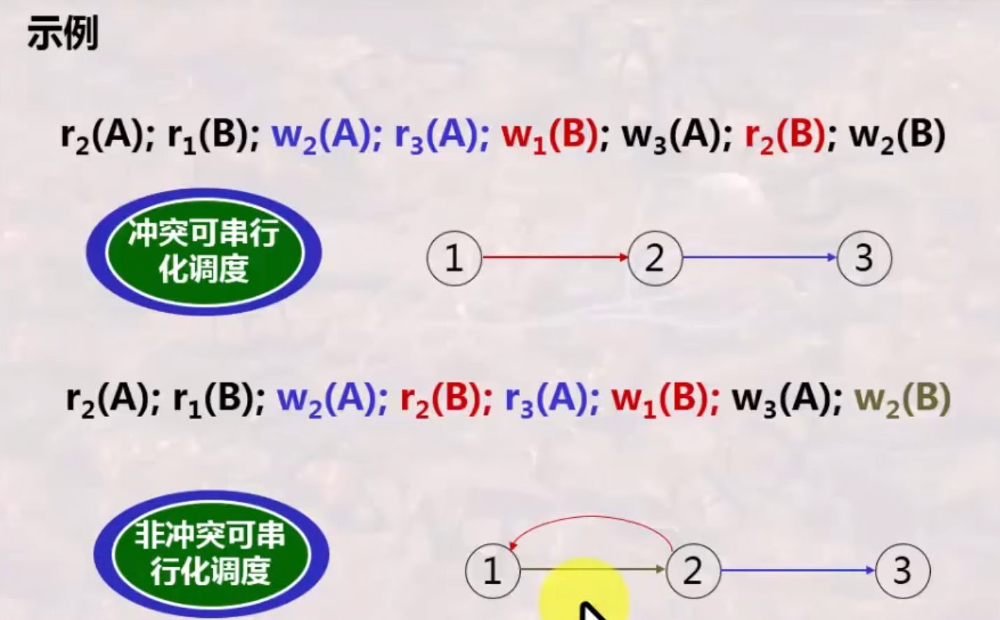

### 文章目录

  * 一：可串行化调度
  * 二：冲突可串行化调度
  *     * （1）冲突操作
    * （2）可串行化调度的充分条件：冲突可串行化
  * 三：两段锁协议
  * 四：封锁的粒度
  *     * （1）概念
    * （2）选择封锁的原则
    * （3）多粒度封锁
    *       * A：多粒度树
      * B：多粒度封锁协议
    * （4）意向锁

# 一：可串行化调度

**可串行化调度
：多个事务的并发执行是正确的，当且仅当其结果与按某一次序串行地执行这些事务时的结果相同，称这种调度策略为可串行化(serializable)调度。可串行性是并发事务正确调度的准则，
也即一个给定的并发调度，当且仅当它是可串行化的，才认为是正确调度**

例如，下面有两个事务，分别包含下列操作

> **事务$T_{1}$：** 读B、A=B+1、写回A；  
>  **事务$T_{2}$：** 读A、B=A+1、写回B；

假设A、B初值均为2，两个事务最多只有两种串行执行策略

  * $T_{1}$->$T_{2}$：A=3，B=4
  * $T_{2}$-> $T_{1}$：A=4，B=3

**因此事务 $T_{1}$和 $T_{2}$不管怎样交叉并行运行，只有两种正确的结果（如上）。其他结果均是错误的，相应调度也称之为不可串行化调度**

# 二：冲突可串行化调度

## （1）冲突操作

**冲突操作 ：是指不同事务对同一个数据的读写操作和写写操作。除此之外，其他操作均为不冲突操作**

  * $R_{i}(x)$与$W_{j}(x)$：事务$T_{i}$读x，事务 $T_{j}$写x
  * $W_{i}(x)$与 $W_{j}(x)$：事务$T_{i}$写x，事务$T_{j}$写x

**另外注意各种交换**

  * **不同事务的冲突操作 不可交换**
  *  **同一事务内部的两个操作 不可交换**
  *  **不同事务，同一数据的读读操作 可以交换**
  *  **不同事务，不同数据，无论读写 均可交换**

## （2）可串行化调度的充分条件：冲突可串行化

**冲突可串行性:** -一个调度,如果通过交换相邻两个无冲突的操作能够转换到某一个串行的调度,则称此调度为冲突可串行化的调度。

  * 注意： **冲突可串行化调度是可串行化调度的充分条件，不是必要条件。也就是说有可能某个调度是可串行调度，但它却不是冲突可串行化调度**

>冲突可串行性是比可串行性要严格的概念
>满足冲突可串行性, 一定满足可串行性;反之不然。
## （3）冲突可串行性判别算法

# 三：两段锁协议

**两段锁协议（2PL） ：两段锁协议是三级封锁协议的特例，目前DBMS普遍采用该种协议实现并发调度的可串行性。具体内容如下**

  * **在对任何数据进行读、写操作之前，首先要申请并获得对该数据的封锁**
  *  **在释放一个封锁之后，事务不再申请和获得任何其他封锁**

**其中“两段”是指事务分为两个阶段**

  * **第一阶段：获得封锁，也称为 扩展阶段**
  *  **第二阶段：释放封锁，也称为 收缩阶段**

**另外还需要注意**

  * **事务遵守两段锁协议是可串行化调度的 充分条件，而非必要条件**
  *  **若并发事物都遵循两段锁协议，则对其的任何并发点都策略都是可串行化的**
  *  **若对并发事务的一个调度是可串行化的，不一定所有事务都符合两段锁协议**

**最后注意区分两段锁协议和一次封锁法**

  * 一次封锁法要求每个事务必须一次将所有要使用的数据全部加锁，否则就不能继续执行，因此 **一次封锁法遵守两段锁协议**
  * 但是两段锁协议并不要求事务必须一次将所有要使用的数据全部加锁，因此 **遵守两段锁协议的事务可能发生死锁**

# 四：封锁的粒度

## （1）概念

**封锁粒度(granularity)
：是指封锁对象的大小。封锁对象可以是逻辑单元，也可以是物理单元。封锁粒度与系统并发度和并发控制的开销密切相关，一般来说，封锁粒度越大，数据库所能封锁的数据单元就越少，并发度越小，开销越小**

  * **逻辑单元** ：元组、关系、整个数据库等
  *  **物理单元** ：页（数据页或索引页）、物理记录等

## （2）选择封锁的原则

  * **需要处理多个关系的大量元组的用户事务时以 数据库为封锁单位**
  *  **需要处理大量元组的用户事务时以 关系为封锁单元**
  *  **只处理少量元组的用户事务时以 元组为封锁单位**

## （3）多粒度封锁

**多粒度封锁 ：在一个系统中同时支持多种封锁粒度供不同的事务选择**

### A：多粒度树

多粒度树是以 **树形结构** 来表示多级封锁粒度的方法

  * **根结点** 是整个数据库，表示最大的数据粒度
  *  **叶结点** 表示最小的数据粒度

### B：多粒度封锁协议

**多粒度封锁协议
：允许多粒度树中的每个结点被独立地加锁，对一个结点加锁意味着这个结点的所有后裔结点也会被加上相同类型的锁。因此，在多粒度封锁中一个数据对象可能存在如下两种封锁方式**

  * **显式封锁 ：直接加到数据库对象上的封锁**
  *  **隐式封锁 ：由于上级结点加锁而使该数据对象也被加锁**

**多粒度封锁方法中，显式封锁和隐式封锁的效果是一样的，因此系统检查封锁冲突时不仅要检查显式封锁还要检查隐式封锁**

  * 例如事务 T T T要对关系 R 1 R_{1} R1​加 X X X锁，系统必须搜索其 **上级结点** 数据库、关系 R 1 R_{1} R1​以及 R 1 R_{1} R1​的 **下级结点** ，即 R 1 R_{1} R1​中的每一个元组，上下搜索。如果其中某一个数据对象已经加了不相容锁，则 T T T必须等待

## （4）意向锁

  * 一般地，对某个数据对象加锁，系统要检查该数据对象上有无显式封锁与之冲突:再检查其所有上级结点，看本事务的显式封锁是否与该数据对象上的隐式封锁(即由于上级结点已加的封锁造成的)冲突;还要检查其所有下级结点，看它们的显式封锁是否与本事务的隐式封锁(将加到下级结点的封锁)冲突
  *  **可以看出，这样的检查方法效率很低，因此意向锁由此诞生**

* * *

**意向锁 ：如果对一个结点加意向锁，则说明该结点的下层结点正在被加锁；对任一结点加锁时，必须先对它的上层结点加意向锁。有如下三种常用的意向锁**

  * **意向共享锁（IS锁） ：如果对一个数据对象加IS锁，表示它的后裔结点拟(意向)加S锁**
  *  **意向排他锁（IX锁） ：如果对一个数据对象加IX锁，表示它的后裔结点拟(意向)加X锁**
  *  **共享意向排他锁（SIX锁） ：如果对一个数据对象加SIX锁，表示对它加S锁，再加IX锁，即SIX=S+IX**

* * *

锁相容矩阵

