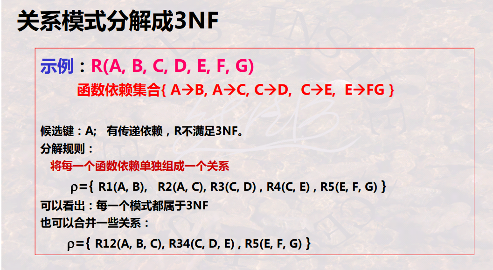
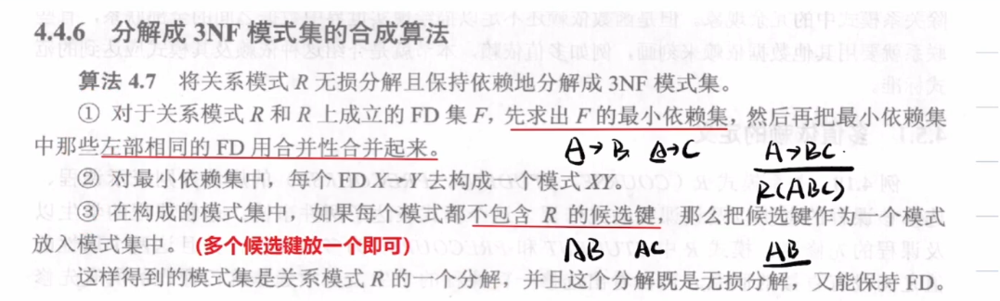

# 3NF分解
简单分解

## 无损分解

教学数据库有4个基本表
学生表S(S#,SNAME,SEX)
其中各字段含义为：S#学号，SNA学生姓名，SEX学生性别
课程表C(C#,CNAME,T#)
其中各字段含义为：C#课程：CNAME课程名，T#教师号
选课表SC(S#,C#,GRADE)
其中各字段含义为：S#学号，，C#课程号，GRADE成绩；
教师表T(T#,TNAME)
其中各字段为含义为：T#教师号，TNAME教师名；
现假设有一个查询为：检索选修了ZHENG老师所授“数据库系统原理”的男同学的姓名和成绩
请按题要求完成下列各题：
1.试用关系代数的笛卡尔积表示上述查询，画出查询表达式的语法树。(8分)
2.对第1小题的查询语法树进行优化，画出优化之后的查询语法树。(7分)

