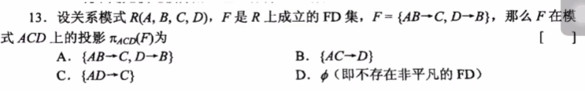

# 函数依赖集的投影



## 函数依赖集的投影

```auto
1.对关系模式R的FD进行推断，把所有的依赖集记为G
2.对投影的关系模式R1的真子集X 在原FD中求闭包，把闭包中属于R1的属性集记为A.
3.在G中查找满足X->A的函数FD添加到R1的FD中，记为F
4.对F求最小依赖集
```

例：R(A,B,C,D) FD: A->B,B->C,C->D 投影获得R1(A,C,D) 求R1的FD  
1.对R的FD进行推断 FD：

```auto
A->B,A->C,A->D,B->C,B->D,C->D,AC->B,AB->C,AB->D,AC->D；
```

2.求真子集闭包

```auto
{A}+:{A,B,C,D} A为候选键，所以A的超集不用再求闭包
{C}+:{C,D}
{D}+:{D}
{CD}+:{C,D}
```

3.在{A}+中查询满足X->A（因为B不在R1中,所有要把B删除）的依赖  
A->C,A->D,AC->D;  
同理 对余下进行查询

```auto
{C}+ FD:C->D
{D}+ FD:无
{CD}+ FD:C->D
```

所以R1的FD为A->C,A->D,AC->D,C->D;  
4.对R1的FD求最小依赖集  
得到最后结果

```auto
R1(A,C,D) FD:A->C,A->D,C->D
```


