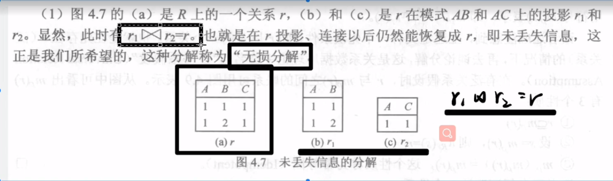
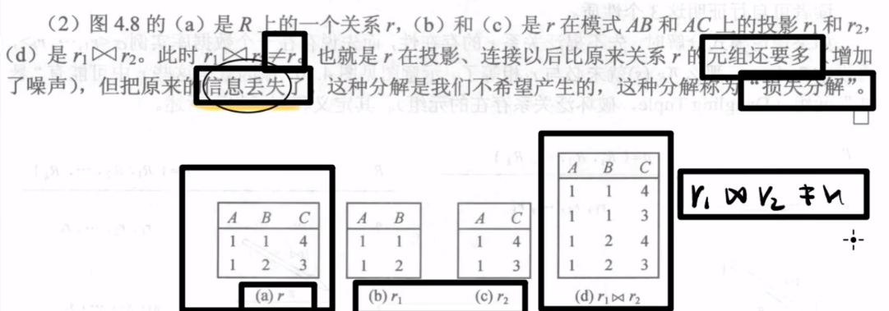
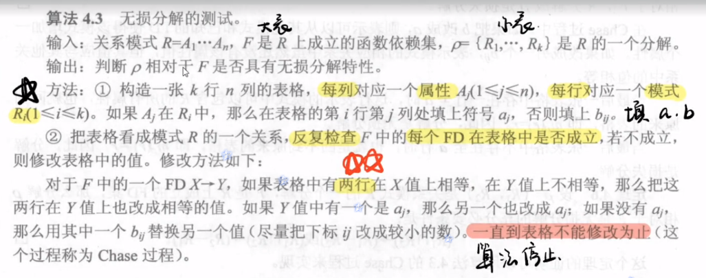
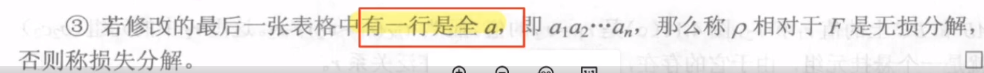

# 无损分解判定

## 定理：

## 表格法

$$
\pi_{s_name}(\sigma_{gender='女'}(Student)\bowtie\sigma_{c_name='数学'}(Course)\bowtie_{SC.s_no=SC_1.s_no \wedge SC.c_no=SC_1.c_no \wedge SC.grade>SC_1.grade}(SC\times\sigma_{c_name='历史'}(Course)\bowtie SC_1))
$$

2. SELECT S#，SNAME
FROM S
WHERE S# IN
(SELECT S#
FROM SC
WHERE GNADE>= ='90'AND C# IN 
(SELECT C#
FROM C
WHERE CNAME='C语言程序’AND T# IN
(SELECTT#
FROM T
WHERE TNAME='张三)));