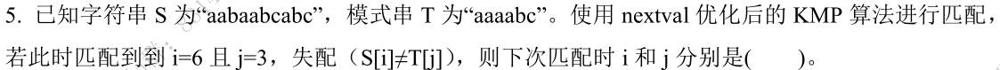
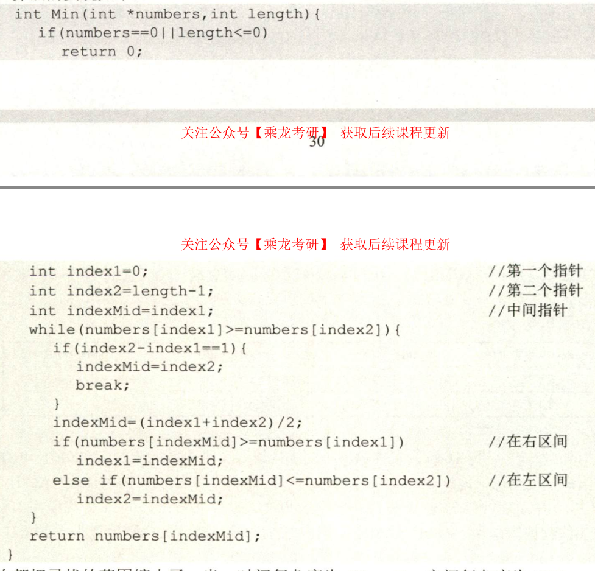
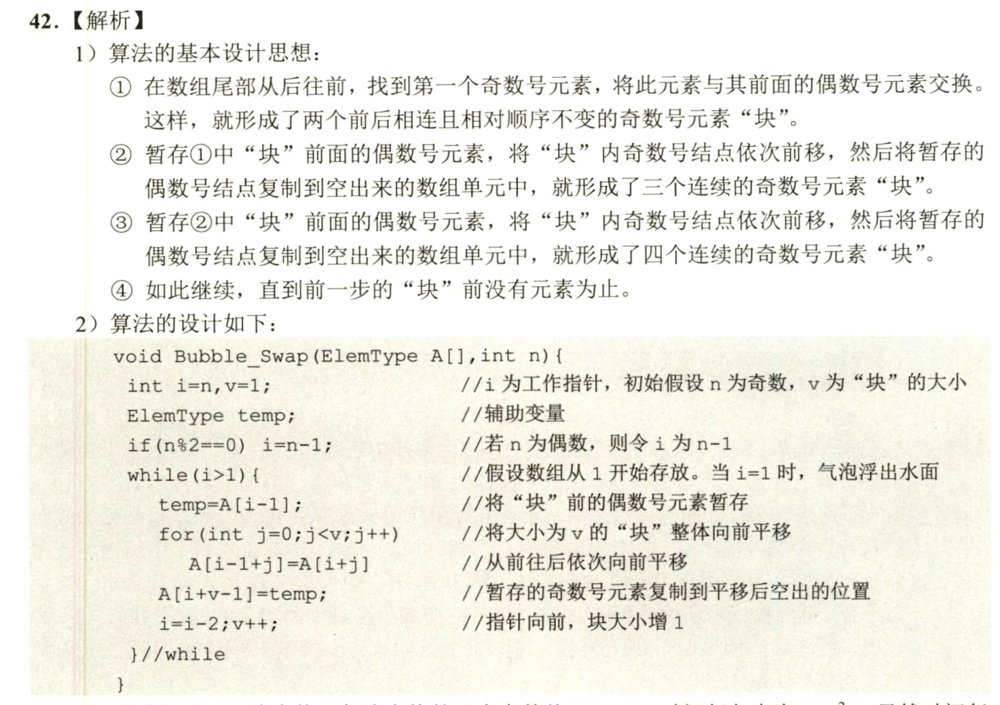
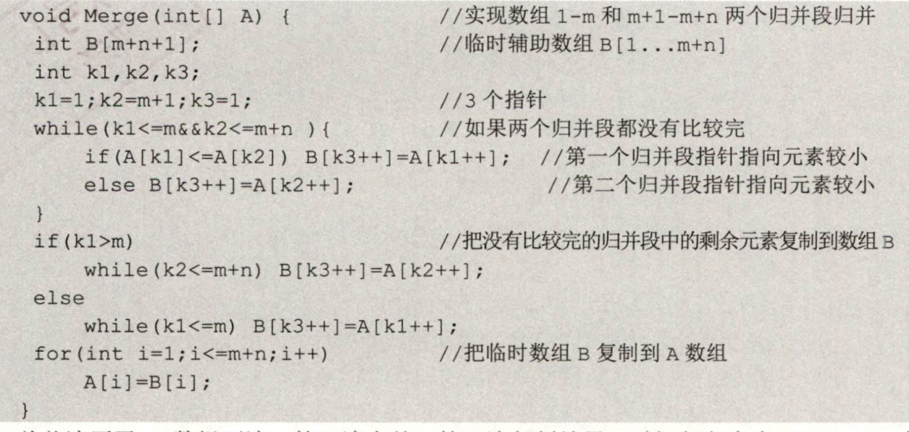
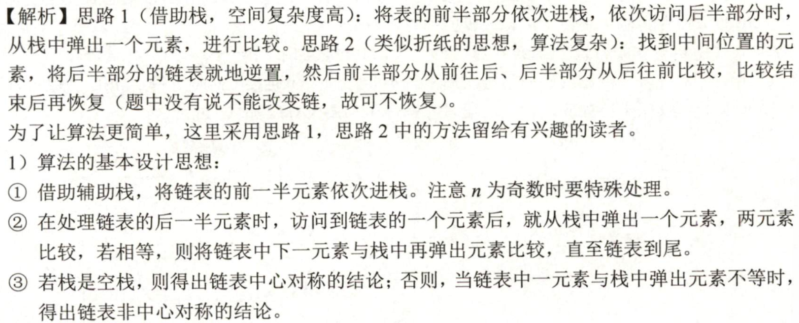
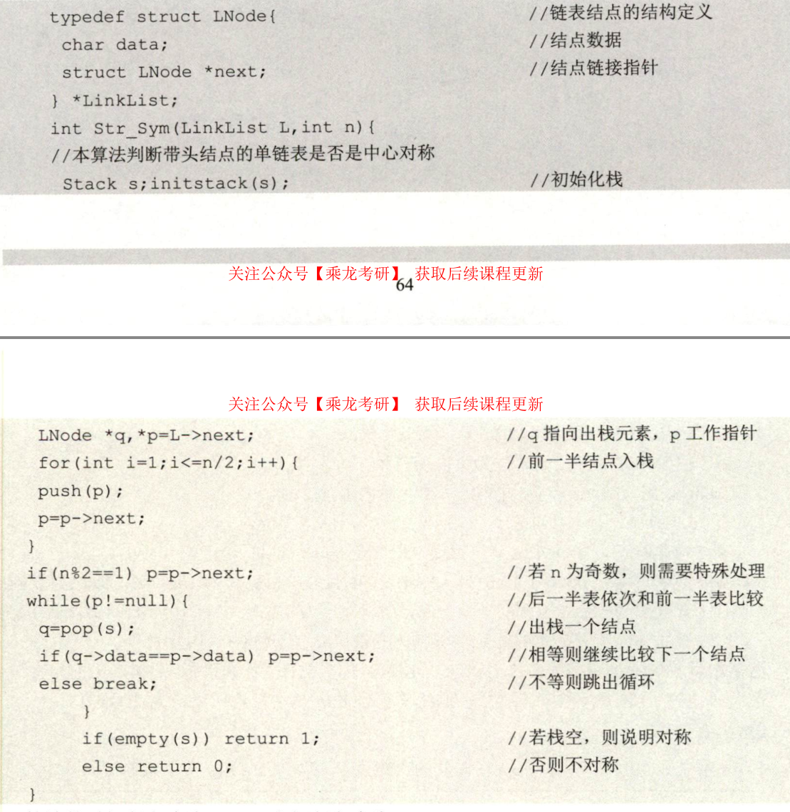

## 逻辑结构
表 数 集合 图
## 存储结构
顺序 链接 索引 散列
## 时间复杂度

遇到内层循环$j<i$,利用等比数列计算时间复杂度

## KMP算法

1. 根据每一位的`字符串的前缀和后缀的最长相等前后缀长度`，构建`PM`数组

2. $next$数组 PM整体右移一位,低位用-1填充(整体加1)

   （是否需要整体加1由下标决定）

3. $nextval$  P116

4. 失配时$i$不变，$j$回退到next(j)或nextval(j)的位置，当$j=0$，$i$和$j$整体加1

   ----

   

答案 6,0    由j=3得下标从1开始 j=nextval[3] i不变

|         | 1    | 2    | 3           | 4           | 5    | 6    |
| ------- | ---- | ---- | ----------- | ----------- | ---- | ---- |
| S       | a    | a    | a           | a           | b    | c    |
| PM      | 0    | 1    | 2           | 3           | 0    | 0    |
| next    | 0    | 1    | 2           | 3           | 4    | 1    |
| S[next] | a    | a    | a           | a           | a    | a    |
| nextval | 0    | 0    | 0           | 0           | 4    | 1    |
|         |      | =nextval[1]| =nextval[2] | =nextval[3] |      |      |


## 栈

n个不同元素进栈，出栈序列的个数为$\frac{1}{n+1}C_{2n}^n$

## 中缀转后缀

1) 操作数直接输出
2) 栈外大（小）的栈内小（大）

## 堆和堆排序

1) 建树，建堆（检查每一非叶节点，按最优调整）
2) 排序，输出树顶元素，重新建堆

## 多路归并

对N个元素进行k路归并排序时，排序的趟数m满足$k^m>=N$ 

## 1


```cpp
class Solution {
public:
    bool helper(SqBiTree T, int i, long long lower, long long upper) {
        if (i >= T.ELemNum || T.SqBiTNode[i] == -1) { // 越界或者为空结点
            return true;
        }
        if (T.SqBiTNode[i] <= lower || T.SqBiTNode[i] >= upper) {
            return false;
        }
        return helper(T, 2 * i + 1, lower, T.SqBiTNode[i]) && helper(T, 2 * i + 2, T.SqBiTNode[i], upper);
    }
    bool isValidBST(SqBiTree T) {
        return helper(T, 0, LONG_MIN, LONG_MAX);
    }
};
```

DFS

## 快速排序
```cpp

void quickSort(int a[], int low ,int high)
{
	if(low<high)  //判断是否满足排序条件，递归的终止条件
	{
		int i = low, j = high;  
		int x = a[low];                                     
		while(i<j)  
		{
		  while(i<j && a[j] >= x) j--;  
		  if(i<j) a[i++] = a[j];   
		  while(i<j && a[i] <= x) i++; 
		  if(i<j) a[j--] = a[i]; 
		} 
	        a[i] = x;   
		quickSort(a, low ,i-1);  
		quickSort(a, i+1 ,high);
	}


```

## 单链表

```c++
class node
{
public:
	int data;    //存储数据
	node *next;  //指向下一个node的地址
};
```


## 二叉树
```c++
struct TreeNode {
  int value; // 结点的值
  int weight; // 结点的权值
  TreeNode* left; // 指向左子结点
  TreeNode* right; // 指向右子结点
};
```


## 二叉排序树

删除叶节点再删除 相同

删除非叶节点再删除 不相同

## IO控制

中断 软件

DMA 硬件

通道 软件和硬件

## 二叉树：在孩子兄弟链表表示的树中求叶子节点的个数
``` C
typedef struct CSNode {
  int val;
  CSNode *firstchild, *nextsibling;
} CSNode, *CSTree;

int dfs(CSTree root) {
  if (!root) return 0;
  else if (!root->firstchild) return 1;
  else {
    int left  =  dfs(root->firstchild);
    int right = dfs(root->nextsibling);
    return left + right;
  }
}
```

## 11

void conversion(int N)
{
Initstack(S);
/初始化空栈s
while (N)
//当N非零时，循环
Push(S,N % 8); //把N与8求余得到的八进制数压入栈S
N =N/8;
//N更新为N与8的商
while（!StackEmpty(S)）//当栈S非空时，循环
Pop(S,e); //弹出栈顶元素e
cout<<e;//输出e


DFS BFS 遍历


## 求最大子段

```C++
int MaxSum(int n, int *a){
int sum=0, b=0;
for(int i=0; i<n; i++){
if (b>0) b+=a[i];
else b=a[i];
if (b>sum) sum=b;
}
return sum;
}
```

## 




## 奇数块前移



## 前半段递增，后半段递减



## 中心对称链表




