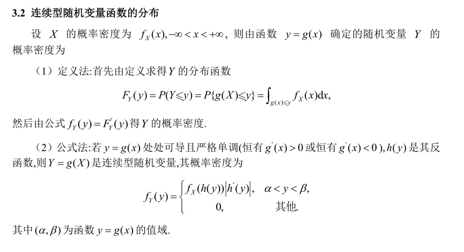
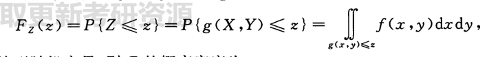
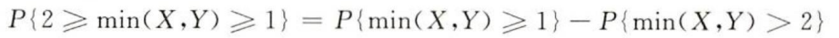
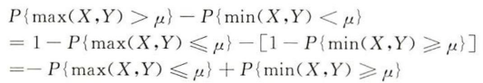

小于等于根据分布求，其它由积分

------------------------------

## 分布

------------------------------------

## 最大最小

+ 两边化一边
  
+ 不确定化确定

----------------------------------------

## 无记忆性

+ 无记忆性：

P(X>t+s | X>t)=P(X>s)
