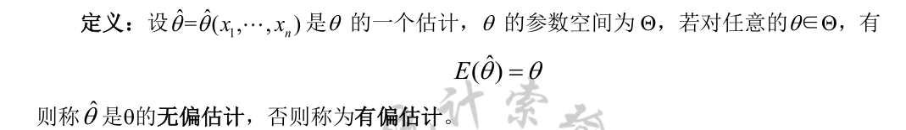
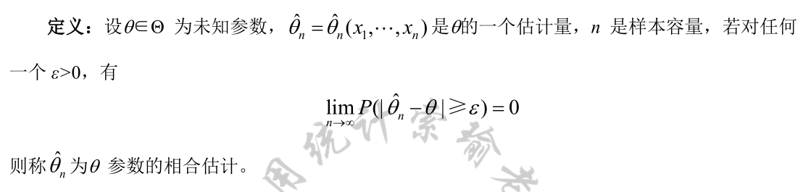
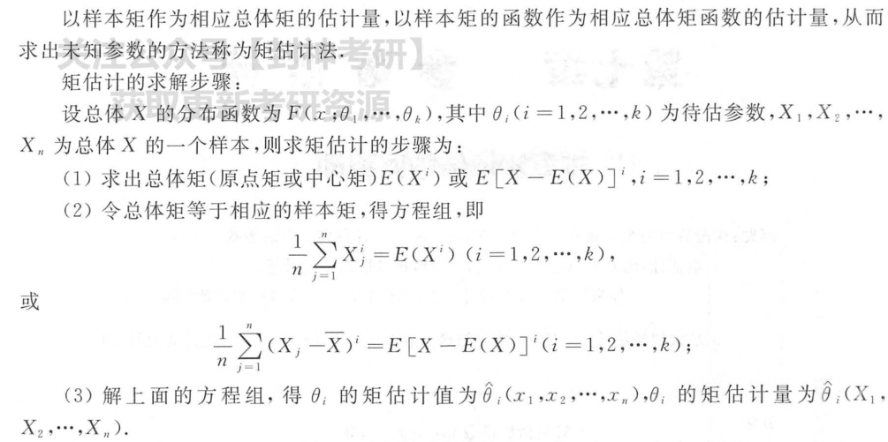
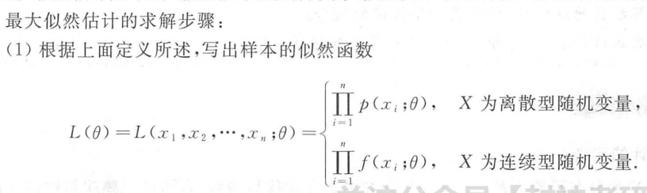
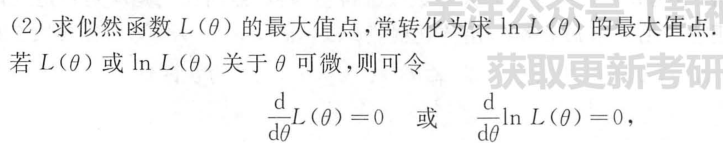
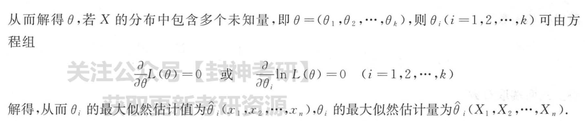
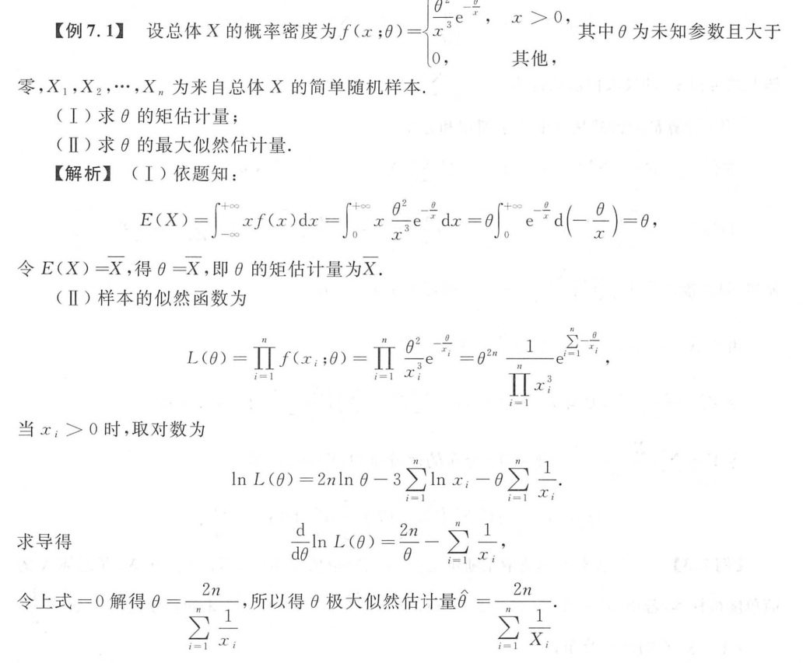
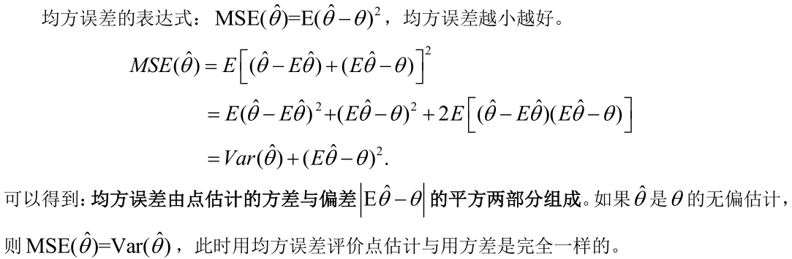

## 参数估计

### 无偏性

### 相合性

我们知道，点估计是一个统计量，因此它是一个随机变量，在样本量一定的条件下，我们不可能要求它完全等同于参数的真实取值。但如果我们有足够的观测值，根据格里纹科定理，随着样本量的不断增大，经验分布函数逼近真实分布函数，因此完全可以要求估计量随着样本量的不断增大而逼近参数真值，这就是相合性，严格定义如下。

### 矩估计

### 极大似然估计

#### 例子

### 均方误差

