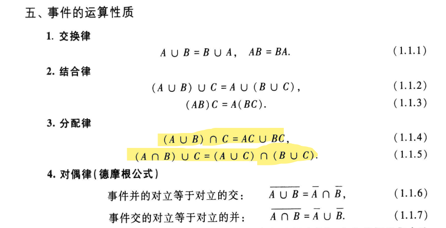
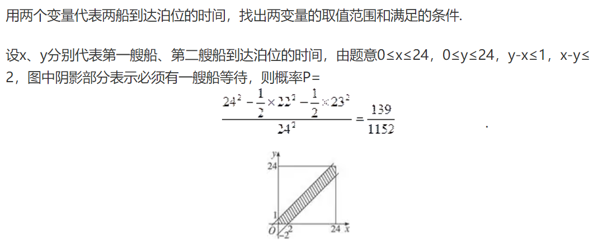

# 随机事件与概率：

---

$\frac{n+1}{C_{2 n}^n}$

（N+n-k-2，n-k)/（N+n-1，n）

(N,m)*(n-1,n-(N-m)) / (N+n-1,n)

构成三角形1/4   构不成3/4



+ 将0与n个1随机地排列，求没有两个1在一起的概率 $\frac{n+1}{C_{2 n}^n}$

+ ***将n个==完全相同==的球随机放入N个盒子中，***

  求：某个指定的盒子中恰有k个球的概率

  ```
  用重复组合的方法解决，|00| | 0|....|000|我们可以把| |看成是盒子，0看成是球。这样除了两边的|不能移动外其他的0和|都可以随意移动，得到总样本点为N+n-1，将球放入盒内得到重复组合总数为（N+n-1，n）。然后在指定的盒子内放入k个球，这样的话总样本点为N+n-k-2，得到重复组合组数为（N+n-k-2，n-k），所以答案为（N+n-k-2，n-k)/（N+n-1，n）
  ---
  无 完全相同 P=C(k,n)*(N-1)^(n-k)/N^n。
  ```
  恰好有m个空盒的概率

  ```
  首先N选m次的组合，选出m个空盒(N,m)  而其余N-m个盒中每一个都分别至少有一个球
  样本总数-球-盒
  (N+n-1)-(N-m)-m=n-1
  剩下的球n-(N-m)  塞入n-1个样本点中
  所以K=(N,m)*(n-1,n-(N-m))
  而样本点总数为N取n次的重复组合，即M=(N+n-1,n)
  故所求概率P=K/M
  ```

  某指定的m个盒子中恰好有j个球的概率

  ```
  两个重复组合
  ```

+ 在区间(0,1)中随机取出两个数，则两个数之和小于6/5的概率  面积

+ 两艘轮船都要停靠同一泊位，它们可能在一昼夜的任意时刻到达.设两船停靠泊位的时间分别为1h与2h，则有一艘船停靠泊位时必须等待一段时间的概率

  

+ 在平面上画有间隔为d 的等距平行线，向平面任意投掷一个边长为a, b,c （均小于d ）的三角形，求三角形与平行线相交的概率

  


