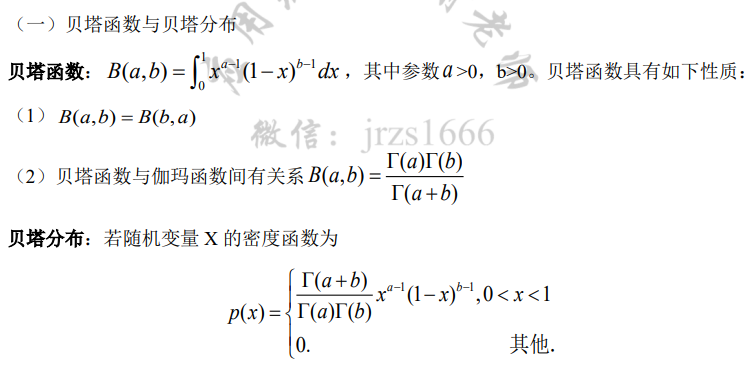

 随机变量及其分布：随机变量及其分布、随机变量的数学期望、随机变量的方差与标准差、常用离散分布（二项分布、泊松分布、几何分布、负二项分布）、常用连续分布（正态分布、均匀分布、指数分布、伽马分布、贝塔分布）、随机变量函数的分布、分布的其他特征数；

### 常用离散分布（二项分布、泊松分布、几何分布、负二项分布）

#### 泊松分布

## 常用连续分布（正态分布、均匀分布、指数分布、伽马分布、贝塔分布）

### 贝塔分布

