## 参数估计

参数估计：点估计的概念与无偏性、矩估计及相合性、极大似然估计、均方误差、充分性原则、贝叶斯估计、区间估计；

### 无偏性

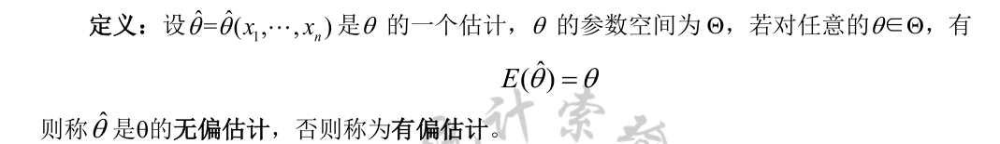

### 相合性

我们知道，点估计是一个统计量，因此它是一个随机变量，在样本量一定的条件下，我们不可能要求它完全等同于参数的真实取值。但如果我们有足够的观测值，根据格里纹科定理，随着样本量的不断增大，经验分布函数逼近真实分布函数，因此完全可以要求估计量随着样本量的不断增大而逼近参数真值，这就是相合性，严格定义如下。

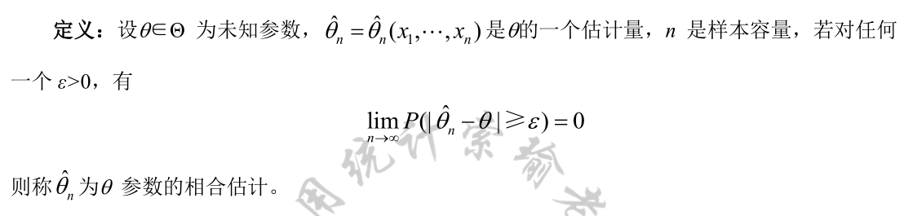

### 矩估计

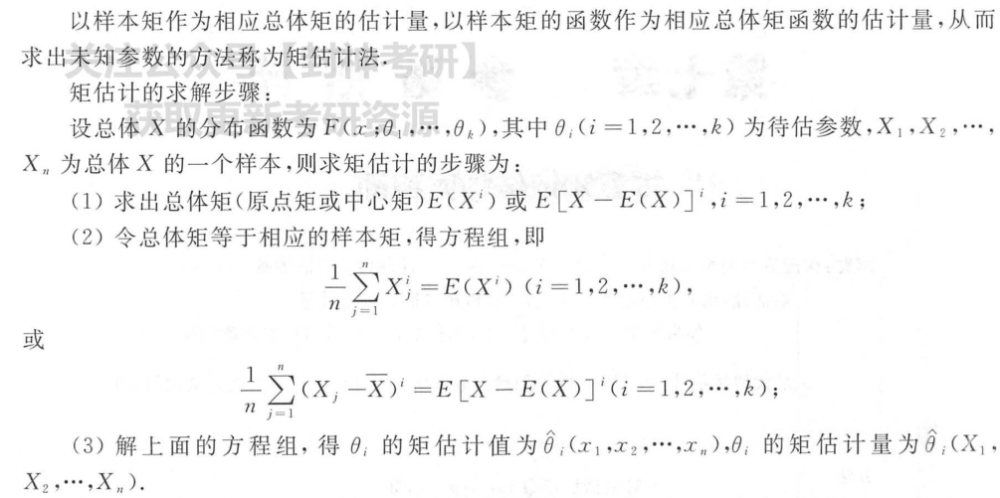

### 极大似然估计

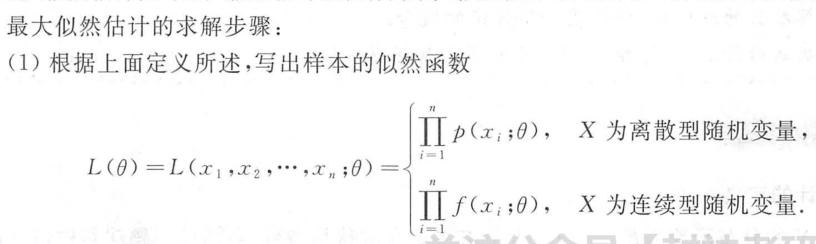

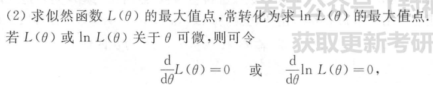

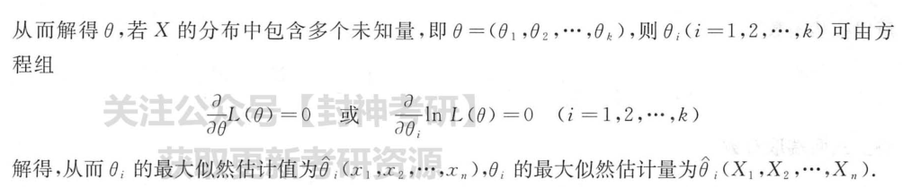

#### 例子

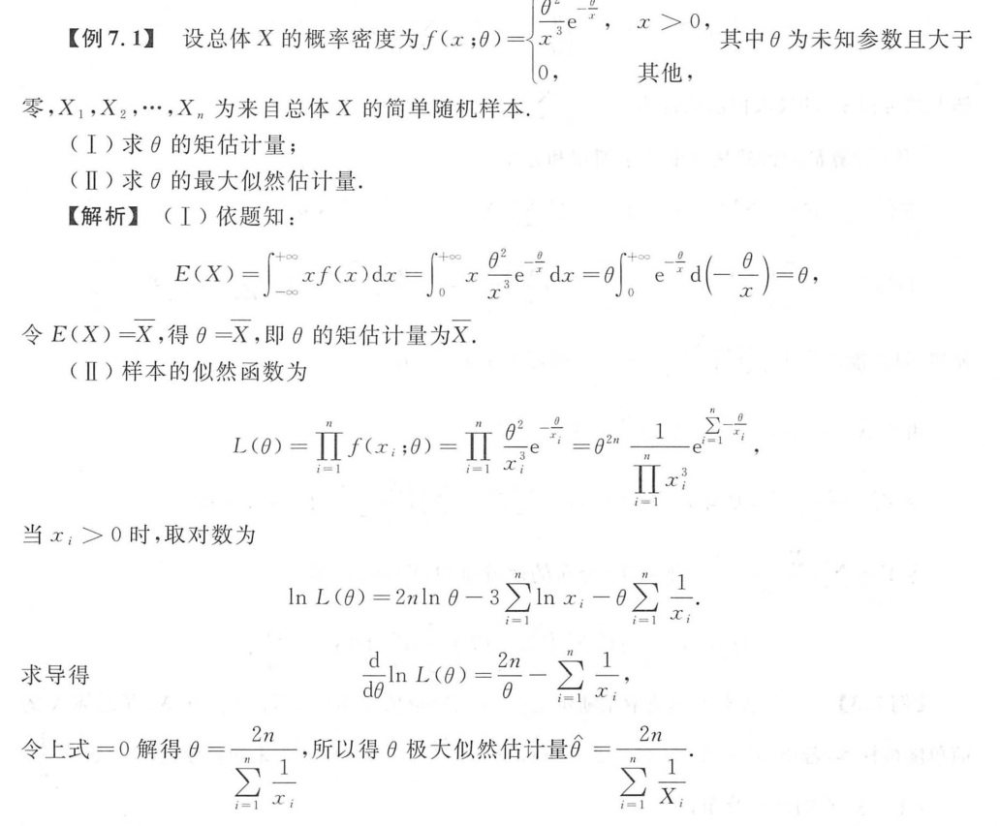

### 均方误差

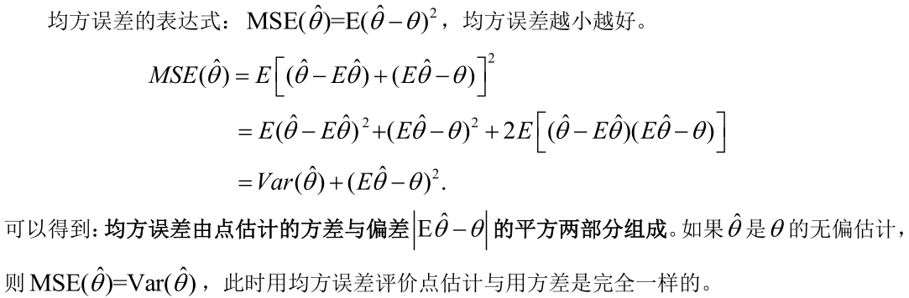

### 充分性原则

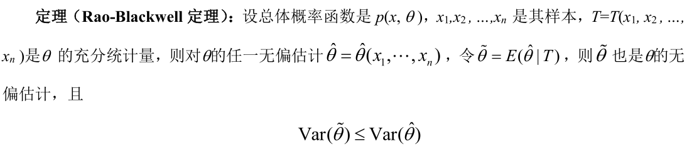

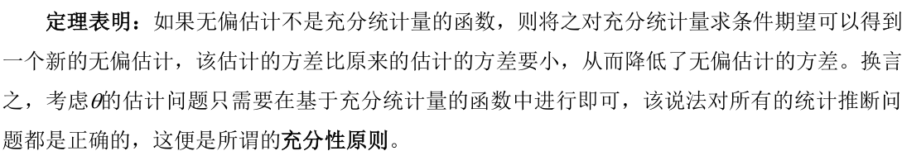

### 贝叶斯估计

#### 后验概率

+ 密度函数h : n+1 项密度函数乘积 

  $h\left(x_1, x_2, \ldots, x_n, \theta\right)=p\left(x_1, x_2, \ldots, x_n \mid \theta\right) \pi(\theta)$
  
+ 边际密度函数m : $\theta$ 的范围

  $m\left(x_1, \cdots, x_n\right)=\int_{\Theta} h\left(x_1, \cdots, x_n, \theta\right) d \theta=\int_{\Theta} p\left(x_1, \cdots, x_n \mid \theta\right) \pi(\theta) d \theta$

+ 条件分布 : $\theta$ 的后验分布

  $\pi\left(\theta \mid x_1, \cdots, x_n\right)=\frac{h\left(x_1, \cdots, x_n, \theta\right)}{m\left(x_1, \cdots, x_n\right)}=\frac{p\left(x_1, \cdots, x_n \mid \theta\right) \pi(\theta)}{\int_{\Theta} p\left(x_1, \cdots, x_n \mid \theta\right) \pi(\theta) d \theta}$

#### 贝叶斯估计

使用后验分布的均值作为 $\theta$ 的点估计，称为后验期望估计

### 区间估计；

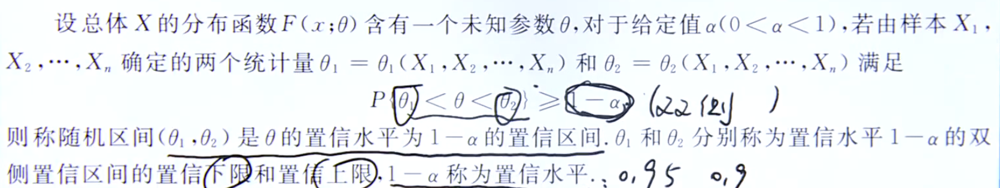

#### 单个正态总体置信区间

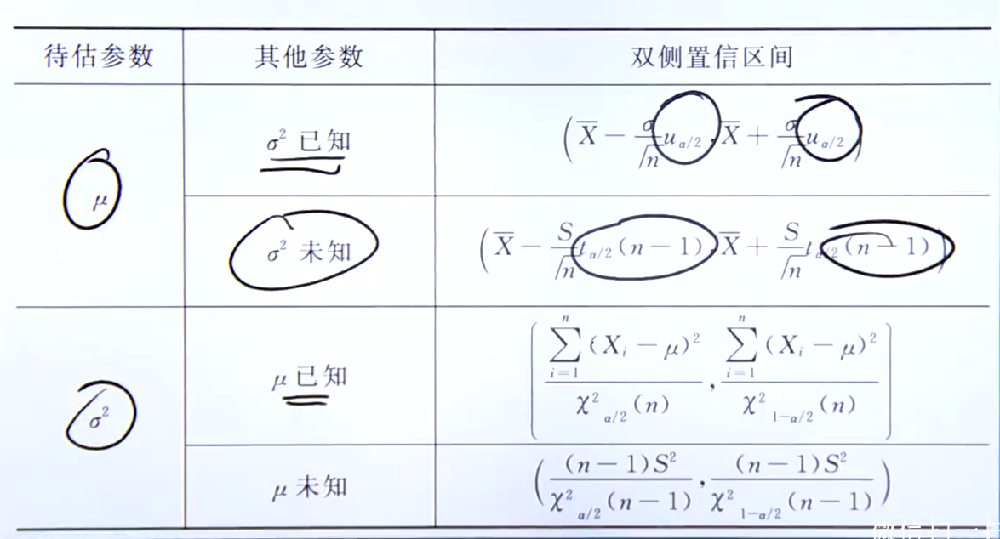

+ 建立统计量T : 注意自由度

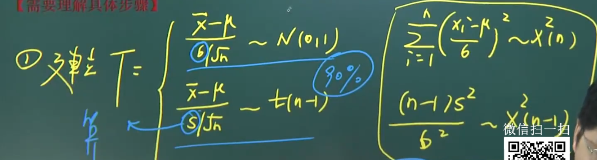

+ 确立统计量的置信区间(画图)

+ 代入统计量

#### 大样本置信区间==(比例)==

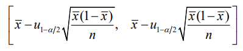
