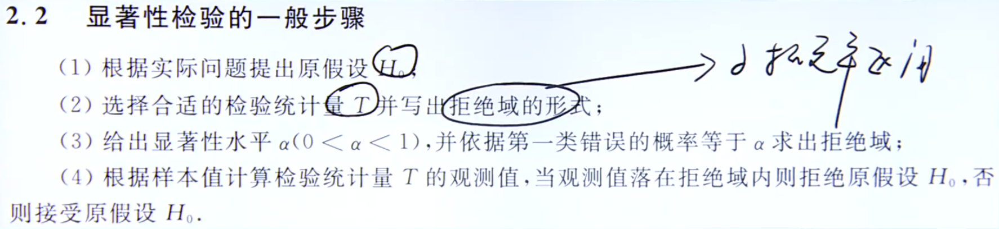
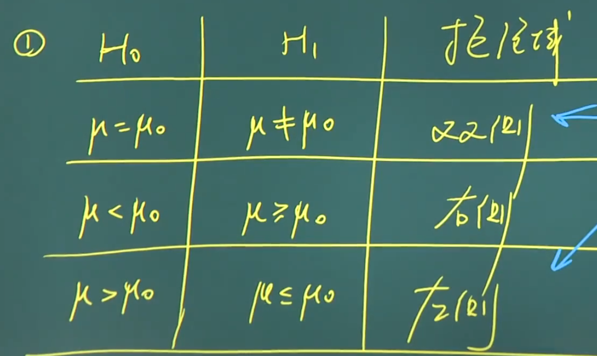

## 假设检验：假设检验的基本思想与概念、正态总体参数假设检验；

总体均值 u置信度为 $95 \%$ 的置信区间为 $\left(\hat{\theta}_1, \hat{\theta}_2\right)$, 其含义是==区间 $\hat{\theta}_1, \hat{\theta}$ 含总体均值 $\mu$ 的真值的概率为 $95 \%$.==

第一类错误(弃真错误):原假设$H_0$为真时拒绝原假设;
第二类错误(取伪错误):原假设$H_0$为假时接受原假设.

拒绝域单侧or双侧

