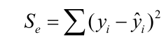

线性回归：

### 一元线性回归

$Q=\sum\left(y_i-\hat{y}_i\right)^2$

$\left\{\begin{array}{l}
\left.\frac{\partial Q}{\partial \beta_0}\right|_{\beta_0=b_0}=-2 \sum_{i=1}^n\left(y_i-b_0-b_1 x_i\right)=0 \\
\left.\frac{\partial Q}{\partial \beta_1}\right|_{\beta_1=b_1}=-2 \sum_{i=1}^n\left(y_i-b_0-b_1 x_i\right) x_i=0
\end{array}\right.$
$$
\begin{aligned}
\bar{x} & =\frac{1}{n} \sum x_i, \bar{y}=\frac{1}{n} \sum y_i, \\
l_{x y} & =\sum\left(x_i-\bar{x}\right)\left(y_i-\bar{y}\right)=\sum x_i y_i-n \bar{x} \cdot \bar{y}=\sum x_i y_i-\frac{1}{n} \sum x_i \sum y_i, \\
l_{x x} & =\sum\left(x_i-\bar{x}\right)^2=\sum x_i^2-n \bar{x}^2=\sum x_i^2-\frac{1}{n}\left(\sum x_i\right)^2, \\
l_{y y} & =\sum\left(y_i-\bar{y}\right)^2=\sum y_i^2-n \bar{y}^2=\sum y_i^2-\frac{1}{n}\left(\sum y_i\right)^2 .
\end{aligned}
$$
解 8.4.8 可得
$$
\left\{\begin{array}{l}
\hat{\beta}_1=l_{x y} / l_{x x}, \\
\hat{\beta}_0=\bar{y}-\hat{\beta}_1 \bar{x}
\end{array}\right.
$$

$\hat{\sigma}^2$的最小二乘估计
$$
\hat{\sigma}^2=\frac{Q_e}{n-2}=\frac{1}{n-2} \sum_{i=1}^n\left(y_i-\hat{y}_i\right)^2 \\

=\frac{1}{n-2} \sum_{i=1}^n\left(y_i-\bar{y}-\hat{\beta}_1\left(x_i-\bar{x}\right)\right)^2 \\
=\frac{1}{n-2}\left[\sum_{i=1}^n\left(y_i-\bar{y}\right)^2-\hat{\beta}_1 \sum_{i=1}^n\left(x_i-\bar{x}\right)\left(y_i-\bar{y}\right)\right]
$$
最小二乘 和 极大似然

系数的置信区间

$\hat{b} \pm t_{\alpha / 2}(n-2) \times \frac{\sigma}{\sqrt{l_{x x}}}$

区间估t

回归是否显著

(3) $H_0: b=0, H_1: b \neq 0$

 

大于 拒绝 显著

