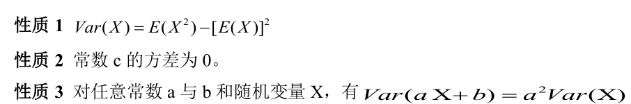

## 随机事件与概率：

```随机事件及其运算、概率的定义及其确定方法、概率的性质（可加性、单调性、加法公式）、条件概率、独立性；```

+ 

+ **单调性**  若 $\mathrm{A} \supset B$, 则 $P(A) \geq P(B)$

+ **加法公式**$P(A\cup B)=P(A)+P(B)-P(A B)$

+ **条件概率** 

  $P{\bigl(}A|B{\bigr)}={\frac{P(A B)}{P(B)}}$
+ **全概率公式** $P(A)=\sum_{i=1}^n P\left(B_i\right) P\left(A \mid B_i\right)$

+ **贝叶斯公式** $\begin{aligned} P\left(B_i \mid A\right) & =\frac{P\left(A B_i\right)}{P(A)}=\frac{P\left(B_i\right) P\left(A \mid B_i\right)}{P(A)} \\ & =\frac{P\left(B_i\right) P\left(A \mid B_i\right)}{\sum_{j=1}^n P\left(B_j\right) P\left(A \mid B_j\right)} \quad i=1,2, \ldots, n\end{aligned}$

+ **独立性 **$P(AB)=P(A)P(B)$

---

==概率 推 概率，不能推事件==

+ 将0与n个1随机地排列，求没有两个1在一起的概率 $\frac{n+1}{C_{2 n}^n}$
+ 单位圆任取三点，构成锐角三角形概率 0.25
+ 一段绳子折成三段，不能构成三角形的概率 0.75

## 随机变量及其分布
```随机变量的数学期望、随机变量的方差与标准差、常用离散分布（二项分布、泊松分布、几何分布、负二项分布）、常用连续分布（正态分布、均匀分布、指数分布、伽马分布、贝塔分布）、随机变量函数的分布、分布的其他特征数；```

+ **数学期望** $E(X)=\int_{-\infty}^{\infty} x p(x) d x$

  若$Y=g(X)$  则$E(X)=\int_{-\infty}^{\infty} g(x) p(x) d x$

+ **方差** $\operatorname{Var}(X)=E(X-E(X))^2=\int_{-\infty}^{\infty}(x-E(X))^2 p(x) d x$

  数学期望存在，方差不一定存在；方差存在，则数学期望一定存在。
  

+ **切比雪夫不等式**

  $P(|X-E(X)| \geq \varepsilon) \leq \frac{\operatorname{Var}(\mathrm{X})}{\varepsilon^2}$

$P(|X-E(X)| \geq \varepsilon) \leq \frac{\operatorname{Var}(\mathrm{X})}{\varepsilon^2}$


二项近似正态np np(1-p)

反解代入乘反函数导数
