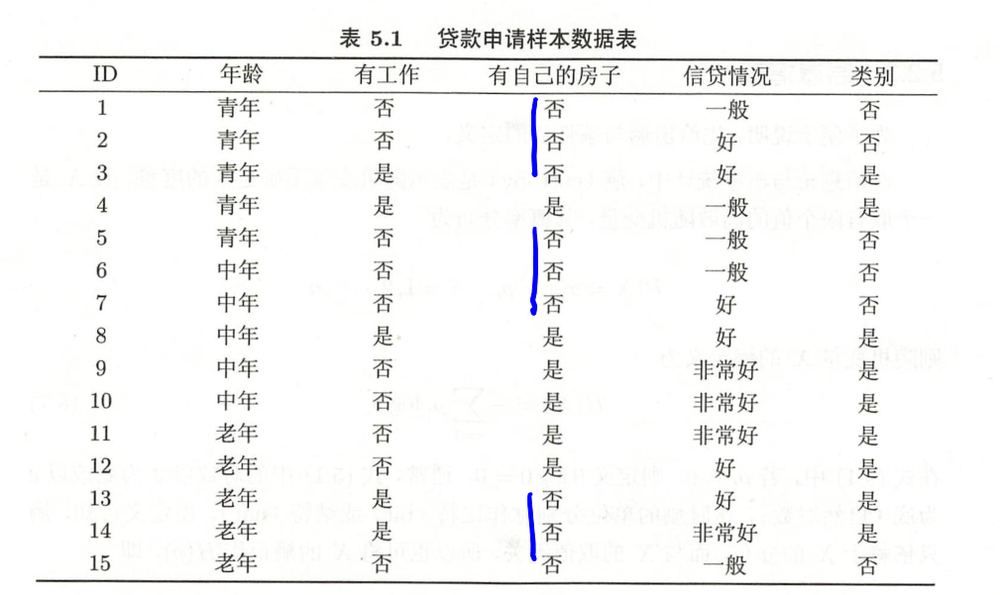
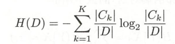
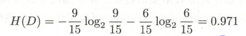
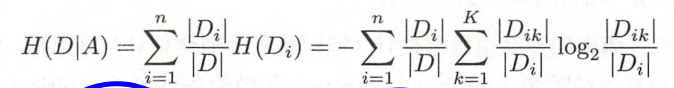
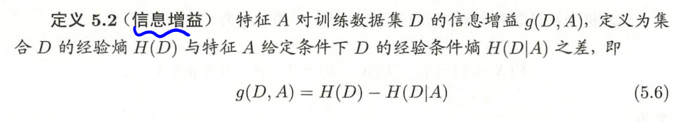
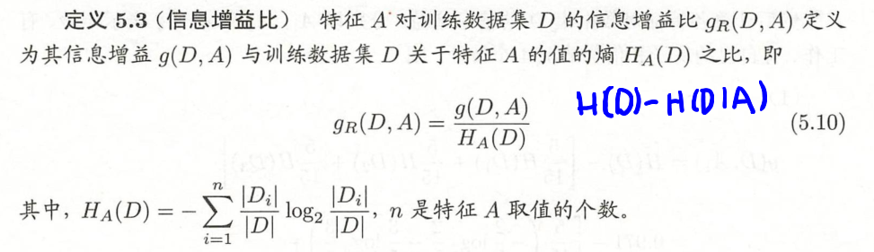
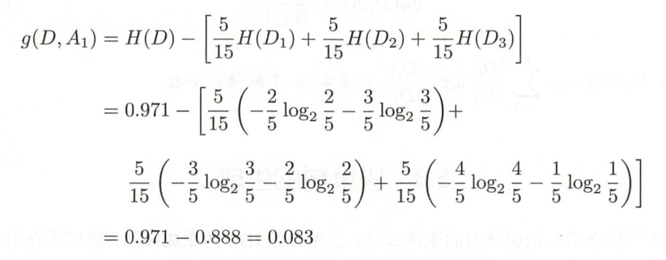
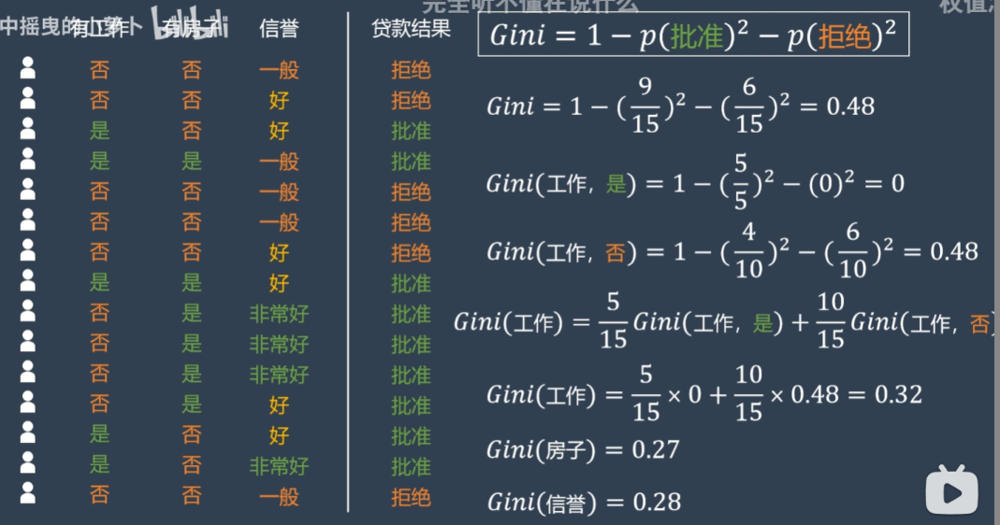

## 题例

## 决策树算法 ID3 ,C4.5

### 第一步：计算数据集D的经验熵H(D)

---

**例**：15个样本中，9个否，6个是

---
### 第二步：计算特征A对数据集D的经验条件熵H(D|A）

### 第三步：计算 信息增益 和 信息增益比

选取信息增益或信息增益比最大的

---

**例**：以年龄为例，分别计算每一年龄类的信息熵，总熵减每类熵的对应比例

---

## 决策树算法 CART

