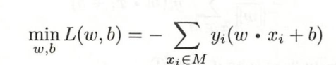
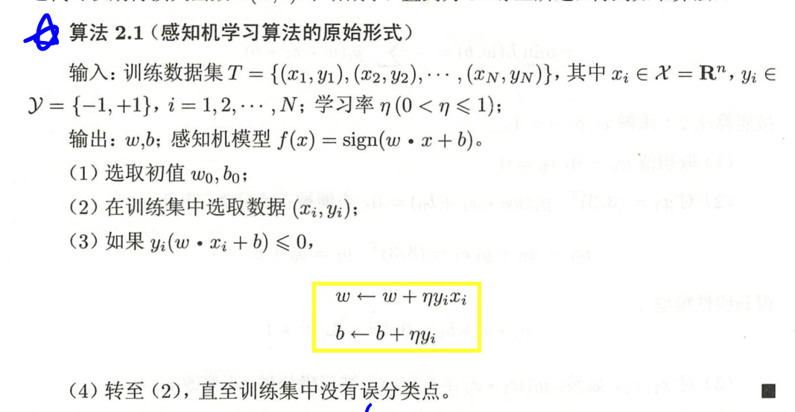
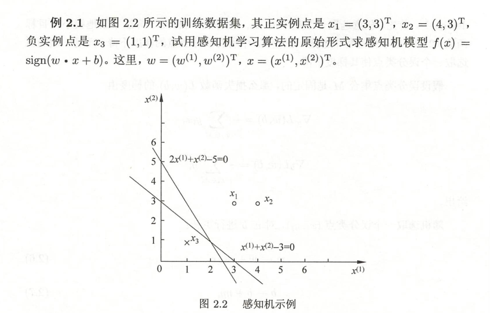
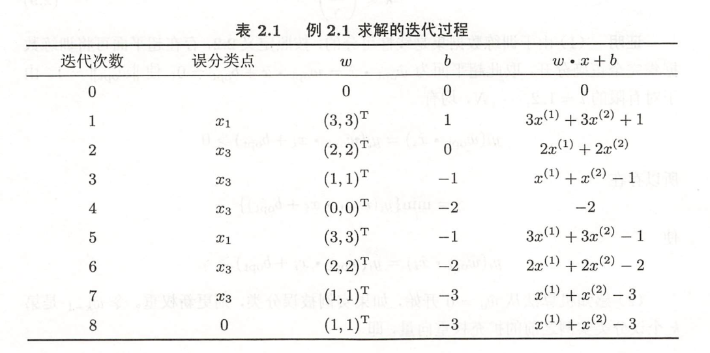
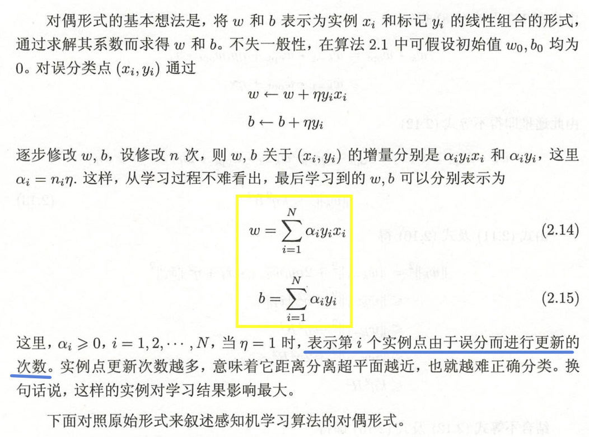
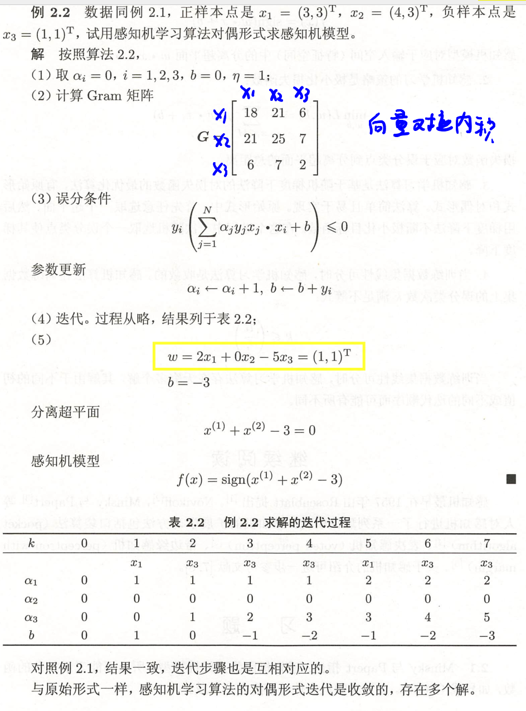

## 感知机学习算法的原始形式
### 算法步骤

### 算法思想
这种学习算法直观上有如下解释：当一个实例点被误分类，即位于分离超平面的错误一侧时，则调整w,b的值，使分离超平面向该误分类点的一侧移动，以减少该误分类点与超平面间的距离，直至超平面越过该误分类点使其被正确分类。
### 例子

感知机学习算法由于采用不同的初值或选取不同的误分类点，解可以不同。

## 感知机学习算法的对偶形式
### 基本思想

### 算法步骤

### 例子

