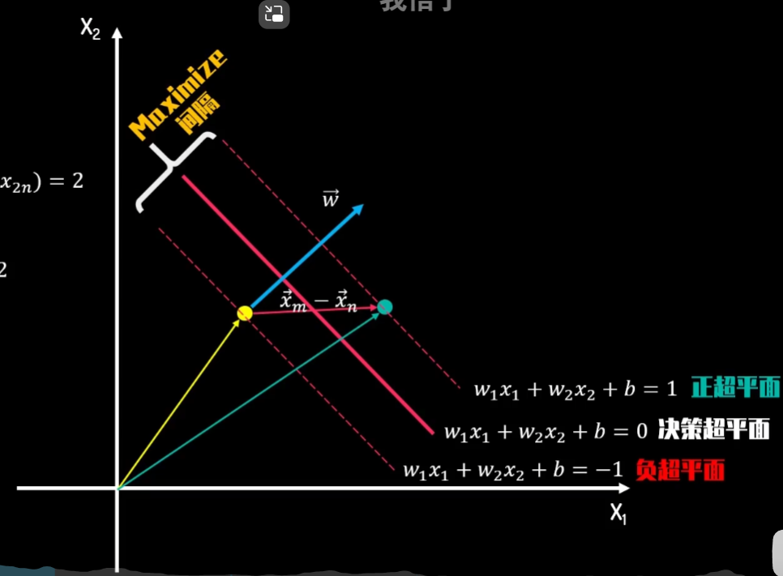
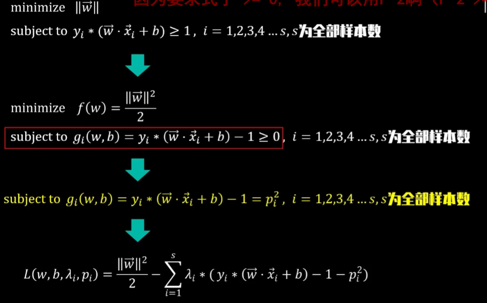

## 1

目标：间隔L 最小化 投影为2
$$
\begin{aligned}
& w_1 x_{1 \mathrm{~m}}+w_2 x_{2 \mathrm{~m}}+b=1 \\
& w_1 x_{1 \mathrm{n}}+w_2 x_{2 \mathrm{n}}+b=-1 \\
& w_1\left(x_{1 \mathrm{~m}}-x_{1 n}\right)+w_2\left(x_{2 \mathrm{~m}}-x_{2 n}\right)=2 \\
& \vec{w} \cdot\left(\vec{x}_m-\vec{x}_n\right)=2 \\
& \left\|\vec{x}_m-\vec{x}_n\right\| * \cos \theta *\|\vec{w}\|=2 \\
& \left\|\vec{x}_m-\vec{x}_n\right\| * \cos \theta=L \\
& L *\|\vec{w}\|=2 \\
& L=\frac{2}{\|\vec{w}\|}
\end{aligned}
$$

## 2

拉格朗日不等号约束  增加算子