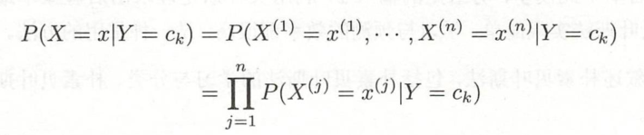
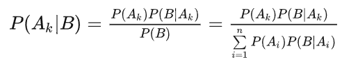
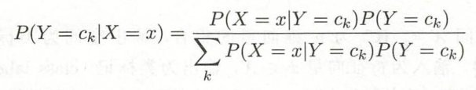
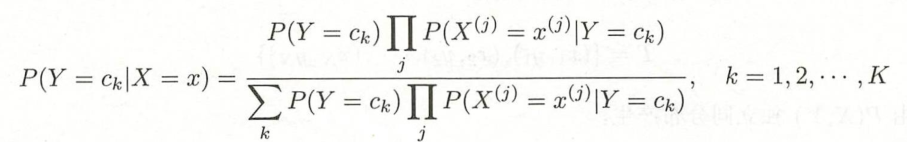
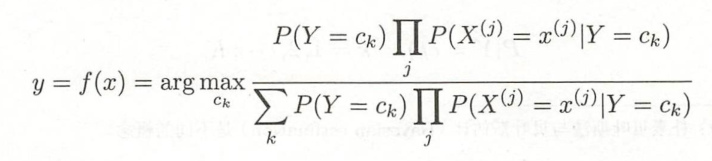
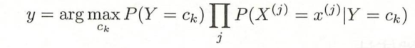
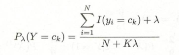
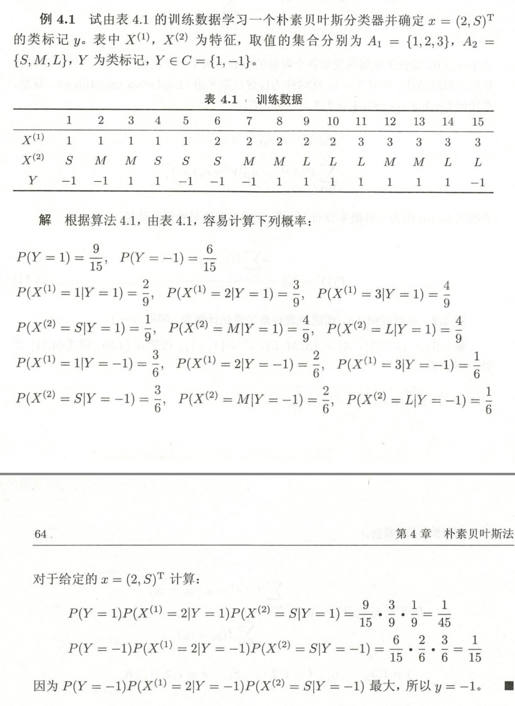
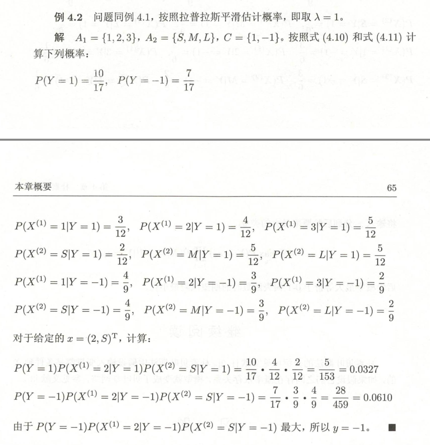

## 前言

朴素贝叶斯(naive Bayes)法是基于贝叶斯定理与特征条件独立假设的分类方法。

对于给定的训练数据集，首先基于`特征条件独立`假设学习输入输出的`联合概率分布`；然后基于此模型，对给定的输入，利用贝叶斯定理求出`后验概率` `最大`的输出$y$。

```

```


## 基本方法
### 条件独立性

基于`特征条件独立`假设



### 后验概率
**贝叶斯定理**





代入



### 取概率最大的类

期望风险最小化准则就得到了后验概率最大化准则



分母相同，比较分子


==重要公式==



==重要公式==

```
计算类的概率，计算类下各小条件的概率，对每类相乘
```

## 变式：拉普拉斯平滑

用极大似然估计可能会出现所要估计的概率值为0的情况。



## 例子




