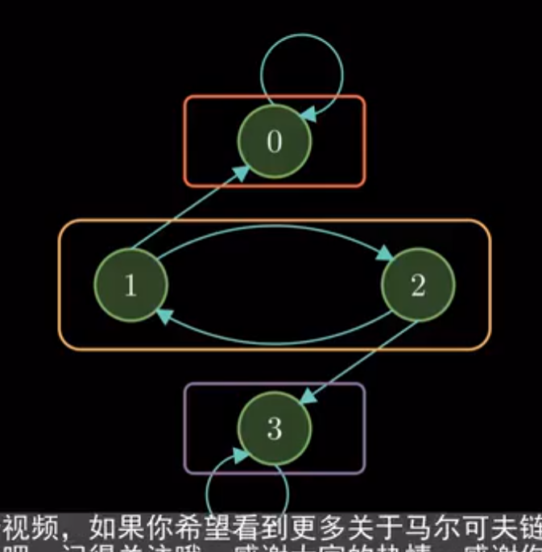

---

---


[题目]: https://blog.csdn.net/ugly_g/article/details/106586648
[]: https://blog.csdn.net/weixin_42570192/article/details/122162200
[]: https://zhuanlan.zhihu.com/p/365366443


## 性质
### 常返性

若马尔可夫链到达一个状态后，在不断转移的过程中，能反复的回到该状态，则该马尔可夫链具有**常返性**。反之称为**瞬时性**。

暂态：自身返回概率小于1的状态（走出了就回不到的状态）

常返：自身返回概率等于1的状态 （永远能回到的状态）


### 不可约性

链条中一个状态可以转移到任意一个状态，也即状态转移图是**强连通的**。反之有些状态无法从其他状态回到的情况，我们称这个马尔可夫链为可约的。因此马尔可夫链的不可约性也称为**连通性**。



```
{0}{1,2}{3}构成连通类
```
### 周期性
马尔可夫链中某一状态具有周期性，是说该状态进过t>1步之后，能反复回到该状态。这里的t是所有能返回该状态的所有路径的最大公约数。如果k=1,那么该马尔可夫链是非周期的。
```
如果某一状态具有周期性，那么它一定具有常返性；但如果某一状态具有常返性，它不一定具有周期性
```
具有平稳分布的马尔可夫链也具有不可约性和非周期性。
## 求概率


## 稳态分布
$P^N$元素全大于0，存在·稳态分布


### 例

