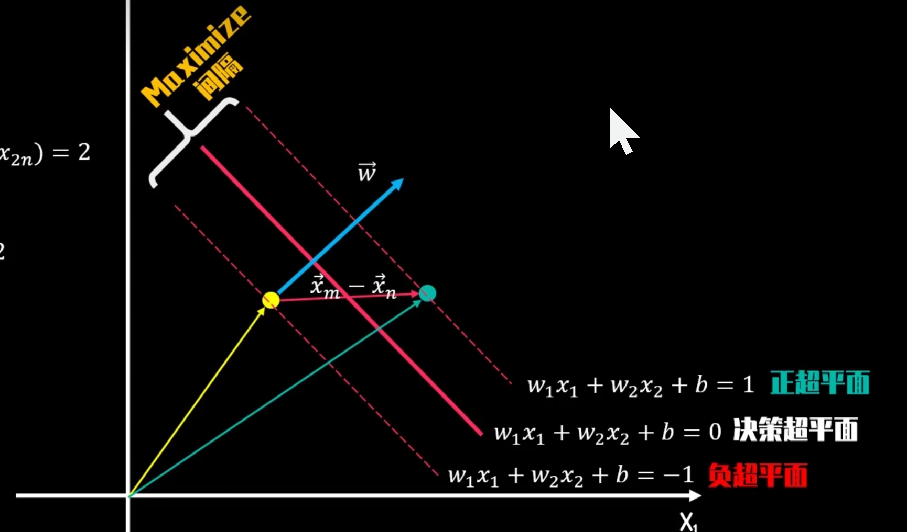
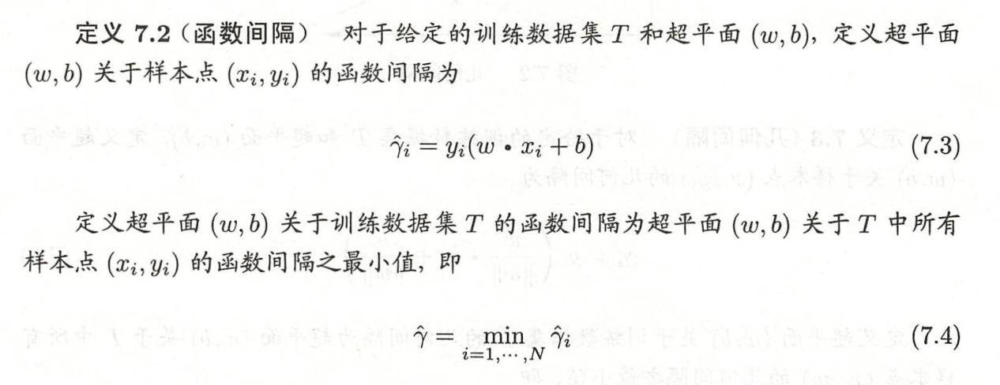
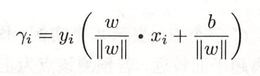
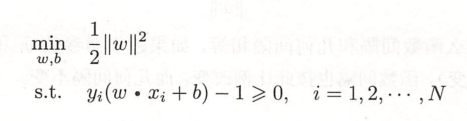
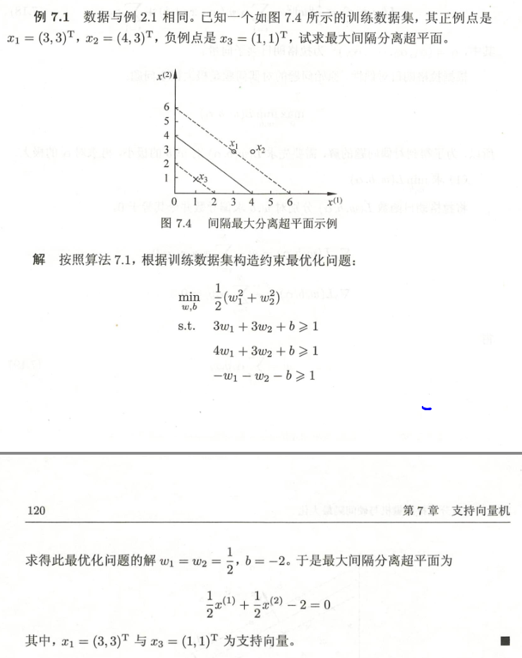
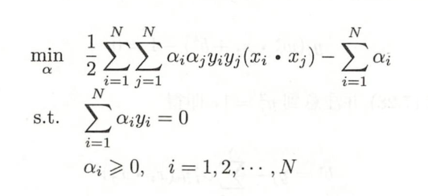
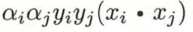
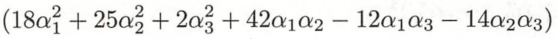
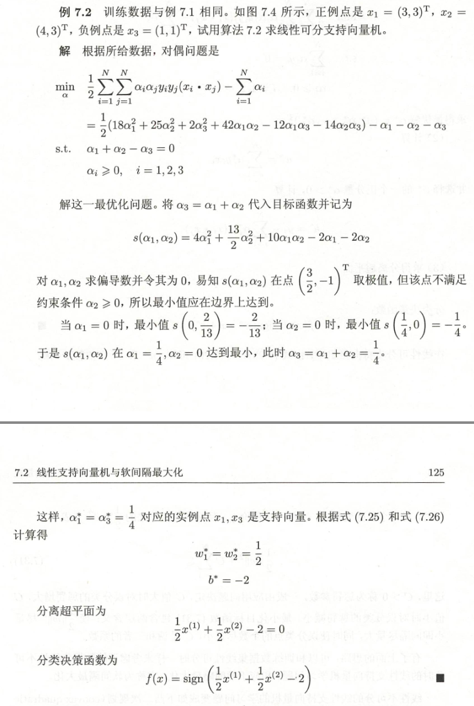
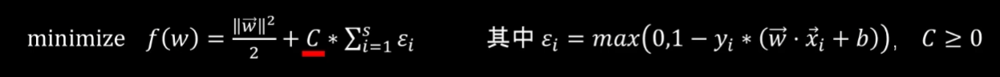

间隔最大使它有别于感知机

## 函数间隔和几何间隔

### 函数间隔

+ 缺陷：函数间隔可以表示分类预测的正确性及确信度。但是选择分离超平面时，只有函数间隔还不够。因为只要成比例地改变w和b,例如将它们改为2w和2b,超平面并没有改变，但函数间隔却成为原来的2倍。这一事实启示我们，可以对分离超平面的法向量w加某些约束，如规范化，w=1,使得间隔是确定的。这时函数间隔成为几
  何间隔（geometric margin）。

### 几何间隔

## 间隔最大化导出优化式

`支持向量`：在线性可分情况下，训练数据集的样本点中与分离超平面距离最近的样本点的实例称为支持向量(support vector)

### 例子

## 学习的对偶形式

### 例子

上面的式子理解成关于$\alpha$关于x的内积的二次型

-----

## 软间隔

