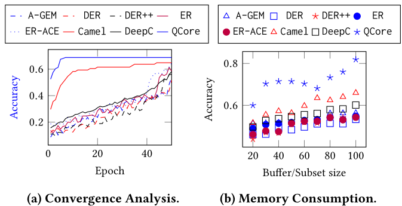

# PVLDB|QCore:高效数据利用，针对量化模型的设备内持续校准

**QCore: Data-Efficient, On-Device Continual Calibration for Quantized Models**

**作者：**David Campos，杨彬，Tung Kieu，张淼，郭晨娟，Christian S. Jensen 

**关键词：**边缘计算，模型量化，持续校准，数据压缩，Bit-Flipping网络 

**论文链接：**

**代码链接：**[decisionintelligence/QCore (github.com)](https://github.com/decisionintelligence/QCore)

[toc]

**摘要：**随着流式数据愈发被广泛应用，我们得以深入挖掘其中隐藏的底层信息。将机器学习模型(例如分类模型)部署在边缘设备上,使得我们能够实时做出决策,而无需将数据传输到服务器。为了能在存储和计算能力有限的边缘设备上部署模型,可以将模型中的全精度参数量化为较少的位数。接着，我们利用完整的训练数据并通过反向传播来校正量化后的模型，以保证模型的准确性。这种一次性的校准方法适用于静态环境中的部署。

然而，对于动态的边缘环境，模型需要进行持续的校准，,以便灵活调整量化模型，使其能够适应可能存在不同分布的新的流入数据。在边缘设备上实现持续校准面临两大挑战：一方面，完整的训练数据可能过于庞大,无法适应边缘设备的存储能力；另一方面，利用反向传播进行校准的计算成本过高。为了解决这些难题,我们提出了QCore方法来实现边缘设备上的持续校准。QCore首先将完整的训练数据压缩为一个较小的子集,以便在边缘设备上校准不同位宽的量化模型。我们还提出了在新的流数据到达时更新该子集的方法,以反映环境的变化,同时不会遗忘早期的训练数据。同时，我们还提出了一种新的流数据到达时更新子集的方法，这样既能反映环境的变化，又不会遗忘早期的训练数据。此外，我们还设计了一个小型的Bit-Flipping网络，它与数据子集一起协同工作，用于更新量化模型的参数，从而实现高效且无需反向传播的持续校准。

我们通过使用真实世界的数据在连续学习环境下进行了实验研究，深入探讨了QCore的特性，实验结果表明，QCore在性能上超越了现有的基准方法。

## 引言

**背景：** 随着物联网的普及和社会与工业流程的不断数字化,越来越多的数据流可以为相关流程提供有价值的见解。为了充分利用这些数据创造价值,需要在接收数据流的边缘设备上实现持续分析和决策制定。分类任务在诸如健康监测、自动驾驶、金融和网络服务等应用中扮演着重要角色。将这类任务部署到边缘设备不仅能增强设备功能,还能减少对外部处理的依赖,提高效率并降低分类延迟。

**挑战：** 分类模型变得越来越复杂，对计算资源的需求也越来越高。然而，这些大型模型通常不适合部署在资源有限的边缘设备上。为了在这类设备上部署分类模型，需要使用量化等技术对模型进行压缩。量化过程需要对模型进行校准以保持性能，但目前的校准方法仍存在两个主要局限性：

1. **数据需求大：** 
- 传统校准方法通常在模型部署前进行一次性操作，需要使用完整的训练数据集和全精度模型。这在流数据环境下显得力不从心，因为模型需要持续校准以适应不断变化的数据分布[^1]。
   
- 边缘设备的存储空间有限，无法存储完整的训练数据集，这进一步限制了传统校准方法的应用。

2. **缺乏边缘校准：** 
   - 现有方法涉及计算成本高昂的反向传播,依赖于全精度浮点数值梯度的精确计算,在边缘设备上并不实用。

为解决这些问题，我们引入了QCore——一个支持在资源受限的边缘设备上准备、部署和持续校准分类模型的框架。

**QCore 数据集**（应对挑战 1）：将整个训练数据集压缩为一个小型行数据子集,用于支持量化模型校准,从而扩展传统范式（[图1](#fig_1)[^1]）。这一过程使用的数据更少,部署速度更快、效率更高，且适合边缘设备,可在新数据到来时进行更新,平衡过去的知识和新知识。同时识别出对于有效和高效地校准各种位宽量化模型的数据示例

图 1：量化分类范例

**Bit-Flipping网络**（应对挑战 2）：引入一个轻量级的辅助网络，用于在没有反向传播的情况下校准量化模型参数。Bit-Flipping网络通过学习量化模型在校准过程中的参数变化，使得可以在不进行反向传播的情况下，对边缘设备上的模型进行高效校准。从而最大限度地减少了边缘设备的负担。

将QCore和Bit-Flipping网络集成，持续调整QCore以响应进入的数据，避免了需要缓冲区以防止遗忘的需求，而是使用了一个稳定大小的数据结构，这对于边缘部署至关重要。

**贡献:**

- 提出了量化感知数据集QCore，可以在压缩完整训练数据集的同时识别能有效校准不同比特位量化模型的的数据示例。
- 引入了一个辅助轻量级网络，用于在设备上高效学习具有量化参数的模型。该网络消除了的反向传播过程，不需要完全精确的参数和梯度计算
- 将QCore和辅助网络集成在一起，以持续调整QCore以适应传入的数据。这避免了使用缓冲区来防止遗忘，而是使用一个稳定大小的数据结构，这对于边缘部署至关重要。
- 报告了广泛的实验，深入探讨了关键的设计决策，并提供了QCore和辅助网络在设备上模型部署中适用性和有效性的证据。

## 方法

QCore概述如[图3](#fig_3)所示。首先，给定一个全精度分类模型，QCore被设计成能够校准不同量化水平的量化模型。这是因为不同的边缘设备可能有不同的资源限制，因此需要不同位宽的量化模型。接下来，根据特定的位宽对全精度模型进行量化，并训练一个相应的小型Bit-Flipping网络，以进一步持续校准。在边缘部署时，使用Bit-Flipping网络更新量化模型，同时使用在运行环境中获得的数据更新QCore。我们考虑到了在不同量化水平下评估每个示例难度的经验观察。我们使用一种称为量化失误（Quantization Misses）的指标来计算这个难度。利用这个指标，我们可以识别出全训练数据集中与之相关的示例，从而有效地压缩数据集并校准量化模型。

图2：QCore框架概览

###  量化感知子集

#### 量化失误（Quantization Misses）

在分类模型中，我们使用指示函数 $TP_i^s$ 来判断模型在训练步骤 s 是否正确预测了样本 i 的标签：
$$
T P_i^s:= \begin{cases}1 & \text { if } \hat{y}_i^s=y_i \\ 0 & \text { otherwise }\end{cases}
$$
当模型的预测 $\hat{y}_i^s$​ 与真实标签 $y_i$​ 一致时，$TP_i^s$​ 返回 1，否则返回 0。

量化失误发生在模型在训练的连续步骤中先正确分类一个样本，然后在下一个步骤错误分类该样本的情况。

图3：不同精度模型的量化遗漏分布。子集大小10%

通过统计整个训练过程中的量化失误次数，可以得到量化模型训练难度的概率分布。这种分布对于不同的量化模型（例如4位和8位）可能会有显著差异(如[图3](#fig_3)所示)，表明某些样本对于一个模型来说可能对另一个模型来说更具挑战性。

#### 生成 QCore

QCore 的构建基于量化误差分布，通过随机选择具有不同量化误差数量的样本，从而创建出一个规模更小但分布与完整训练集相似的数据子集。例如，我们可以生成仅为训练集十分之一大小的 QCore，但仍然能够反映完整训练集的量化误差分布情况。

算法1:基于QuantMisses构建QCore

[算法1](#alo_1)的核心思想是利用量化误差分布来识别对量化模型训练难度较大的样本。具体来说，算法会首先在不同量化级别下对全精度模型进行临时量化，并统计每个样本在各个量化级别下的量化误差次数。然后，根据量化误差次数的分布情况，对训练集进行采样，生成一个包含不同难度样本的 QCore 子集。

**信息损失**：我们采用$\epsilon$-近似方法来评估使用QCore所导致的信息损失，目标是最小化数据集$\mathcal{D}$和$\mathcal{D}_c$之间的成本函数差异。
$$
\epsilon=\left|\frac{\sum_{k=1}^K k \times N_k}{|\mathcal{D}|}-\frac{\sum_{k=1}^K k \times\left\lfloor\lambda N_k\right\rceil}{\lfloor\lambda|\mathcal{D}|\rceil}\right|
$$
成本函数基于量化失误的数量，通过保持相同的量化失误分布，但数据集规模显著减小，从而控制信息损失在可接受的范围内。
**复杂度**：算法的复杂度主要由训练周期（$E$）、样本数（$N$）和模型参数更新的成本（${BP}_w$）决定。算法的渐进复杂度为$O(E × N × {BP}_w)$，与常规的反向传播训练相同。

### Bit-Flipping网络

边缘设备常面临动态环境，输入数据与训练数据存在差异，因此需要持续校准模型以适应变化。然而，传统的校准方法依赖于计算成本高的反向传播，在边缘设备上难以应用。[图4](#fig_4)展现了Bit-Flipping训练和在设备上校准的基本框架，Bit-Flipping网络通过学习量化模型在校准过程中的参数变化，使得可以在不进行反向传播的情况下，对边缘设备上的模型进行高效校准。

图4:Bit-Flipping训练和设备上校准

#### 训练Bit-Flipping

我们记录了每个参数在模型的第一次校准期间的输入激活和输出响应，并计算它们之间的差值$\Delta A$。当完成反向传播步骤后，参数的变化量$\Delta P$也被计算出来。Bit-Flipping通过计算量化模型参数在输入和输出特征之间的差异来学习参数应如何调整。这些差异被用作训练Bit-Flipping的依据。这些变化量被限制在三个可能的输出值{-1, 0, 1}中，代表参数可能减少一位、保持不变或增加一位。

**[[算法2](#alo_2)]BFN 架构和训练：**

1. **轻量级网络结构：** BFN 采用轻量级的网络结构，例如一个卷积层和一个全连接层，并进行量化，使其位宽与主模型一致。
2. **学习映射关系：** 使用记录的特征差异 ($\Delta A$) 作为 BFN 的输入，参数变化量 ($\Delta P$) 作为目标输出，训练 BFN 学习两者之间的映射关系。

算法2:训练Bit-flipping网络

#### 基于Bit-Flipping的校准

一旦分类模型部署在边缘设备上，就可以使用Bit-Flipping来进行校准。校准过程首先使用分类模型对QCore和输入数据进行推理，预测标签。然后，计算主模型中每个参数的输入和输出特性之间的差异，并使用Bit-Flipping根据这些差异来预测参数的变化。最后，根据Bit-Flipping的预测，更新量化模型中的参数。

[算法3](#alg_3)详细描述了基于Bit-Flipping的校准过程。输入包括QCore$\mathcal{D}_c$、流数据批次$\mathcal{D}_t$、量化模型$Q$和Bit-Flipping$BF$。输出是更新后的量化模型$Q$。在整个校准周期中，对于量化模型$Q$中的每个参数$w_i^s$，都会计算输入激活$A_i^s$和激活输入差值$\Delta A_i^s$，然后根据Bit-Flipping$BF$的预测来更新参数。

算法3:基于Bit-flipping校准方法

#### 复杂性分析

- **训练复杂度：** 时间复杂度与 QCore 的校准过程相同，为$O(E × N × {BP}_w)$
- **推理复杂度：** ${BF}_w$ 的推理过程非常轻量，时间复杂度为 $O(E \times |Q| \times N \times {BF}_w)$，其中 $|Q|$ 为量化模型的参数数量，${BF}_w$为 $BF$ 的计算成本。

### QCore更新

QCore 被引入到边缘设备上，并进行动态更新，以防止灾难性遗忘[^2]。QCore 存储了模型训练过程中的重要信息，例如量化误差的分布情况。通过结合 QCore 和新接收到的数据，模型可以同时学习新知识并保留旧知识。

图5: QCore更新,4位模型,T流批次。当来自数据流的一批数据到达时,QCore会相应地更新,并且通过Bit-Flipping网络对量化模型进行校准

同时，由于数据流在不同的部署中会有所不同，QCore将根据每个数据流和部署进行个性化定制。例如，[图5](#fig_5)中展示的QCore将被专门用于特定的数据流。这种方法可以与经典的持续学习方法进行比较，后者使用缓冲区来存储之前批次的知识。然而，QCore与缓冲区之间的一个关键区别在于，QCore将原始数据和缓冲区整合到一个单一的数据结构中。

QCore的更新遵循一种类似于最初构建QCore时使用的方法，即利用量化误差的分布。然而，更新QCore的过程是根据每个特定模型来进行的，因此每个数据流只会调整自己的QCore。整个过程在[算法4](#alg_4)中有详细的说明。与[算法1](#alg_1)类似，在推理迭代过程中，会对每个样本的标签变化相对于其正确标签进行评估。

算法4:QCore数据集更新方法

[算法4](#alg_4)的时间复杂度为 $O(E \times N)$。

## 实验

论文所用到的数据集见[表1](#tab_1)。

表1：数据集统计

这些数据集可以两两组合成源域和目标域,模拟连续学习的场景。源域用于模型训练和初始校准,而目标域的不同数据分布则用于测试持续校准。

连续学习设置中,目标域被划分为 10 个数据批次,依次输入模型,每次更新 QCore 并使用Bit-Flipping进行校准,然后在相应的测试集上进行评估。

#### 量化感知 QCore

**[[图6](#fig_6)]量化显著影响模型的难度**: 全精度模型和量化模型之间的误差分布存在明显差异，这表明量化确实会影响例程的难度。在全精度模式下，误标数量相对较少，这可能暗示在训练量化模型时，它并非一个可靠的指标。原因在于，它没有涵盖量化模型在处理边界案例时，由于计算复杂度增加而遇到的困难情况，这些情况可能导致模型的校准不准确，即所谓的"量化边缘效应"。

图 6：不同位宽下的量化误差分布图

**[[表2](#tab_2)]QCore 有效识别模型难点**: 使用多个量化级别构建的 QCore 可以更有效地识别不同模型的难点样本，相较于单一量化级别或随机选择的样本集，QCore 在校准量化模型方面表现更优。

**[[表2](#tab_2)]QCore 通用性强**: 仅需一个 QCore 即可校准不同位宽的量化模型，在边缘设备部署时更具实用性和可扩展性。

表 2：不同子集类型下量化模型的平均准确率。DSA 数据集

#### 持续校准评估

**[[表3](#tab_3)]QCore 在时序数据上表现优异**: 在 DSA 和 USC 数据集上，QCore 在大多数情况下都显著优于其他持续学习方法，尤其在低位宽模型中优势更为明显。

**[[表3](#tab_3)]部分场景下 QCore 存在波动**: 在 DSA 数据集的少数情况下，QCore 的性能受到个别 batch 的影响而出现波动，但整体表现仍然稳定。

表 3：持续学习场景下量化模型的平均准确率。DSA 和 USC 数据集

**[[表4](#tab_4)]QCore 适用于图像数据**: 在 Caltech10 图像数据集上，QCore 同样取得了优于其他方法的表现，证明了其在不同数据类型上的适用性。

表 4：持续学习场景下量化模型的平均准确率。Caltech10 数据集

#### 消融实验

**[[表5](#tab_5)]QCore 各组件协同作用**: 完整的 QCore 方法在准确率方面优于移除任何一个组件的方法，表明 QCore 更新和Bit-Flipping机制都对模型的持续学习能力起着重要作用。
**[[表5](#tab_5)]QCore 效率高**: 移除组件后方法的执行时间与完整方法相差不大，说明 QCore 的组件开销较低，效率较高。

表5: 不同输入批次下量化模型的消融实验

#### 数据集采样实验（QCore Construction）

**[[表6](#tab_6)]QCore 优于其他采样策略**: 与最大熵采样、最小置信度采样和基于正态分布假设的采样相比，QCore 在准确率方面表现更优。

**[[表6](#tab_6)]QCore 优于基于梯度的方法**: 与 k-means 变体、GradMatch 和 CRAIG 等基于梯度的核心集构建方法相比，QCore 同样取得了更高的准确率。

表 6：不同核心集构建策略的平均准确率

#### 运行时间和内存消耗

**[[表7](#tab_7)]QCore 运行效率高**: 在持续学习场景下，QCore 的运行时间显著低于其他方法，速度提升可达 3-5 倍。这主要得益于比特翻转网络的设计，它仅需单次推理即可调整模型参数，且收敛速度更快。

表 7：每次校准的平均端到端运行时间（秒）

**[[表8](#tab_8)]QCore 内存消耗低**: QCore 在内存消耗方面表现出色，能够以较低的内存使用量识别合适的样本，在有限的内存空间下也能保持良好的性能。

图 8：收敛性和内存消耗评估。DSA 数据集

## 总结

本文提出的QCore是一种在资源有限的边缘设备上进行设备训练的新型高效方法。QCore利用量化感知子集压缩训练集和流数据，识别最适合训练量化模型的示例，减少每个模型参数的比特数。它还包括一个小型网络，无需反向传播即可实现持续的模型校准，从而大大降低了计算成本，并且可以在边缘设备上进行实施。实验研究结果明确证明了QCore在分类任务中的有效性和效率。该方法还展示了运行时间的改进，并且仅需要使用训练和流数据示例的一小部分来构建一个合适的子集。

---

[^1]:（a）在传统的一次性校准范式中，需要使用完整的训练数据集来执行使用反向传播 ) （b）在持续校准范式QCore中，完整的训练数据集被压缩成一个小集，适合存储空间有限的边缘设备；并且可以使用输入的流数据更新 QCore。接下来，Bit-Flipping网络可在无BP 的情况下实现持续校准
[^2]:在目标动态环境中，传入流数据中的分布可能与原始训练数据中的分布大相径庭。Example 1：当车辆在不同气候或不同驾驶员行为和交通条件下行驶时，就会出现这种情况。这就需要对过去的数据和新数据进行重新校准；Example 2：当海拔高度和温度发生变化、气压测值发生变化[45]或驾驶员行为发生变化时，带有驾驶辅助系统的车辆可能会调整车载传感器分类器。
[^2]:当模型部署到不同的边缘设备上时，它们会遇到不同的数据环境。每个量化模型都使用其自身接收到的数据流进行校准，例如[图5](#fig_5)底部展示的 4 比特模型和数据流。然而，如果只考虑新数据，模型可能会丢失其先前学习到的知识，这种现象被称为灾难性遗忘（atastrophic forgetting）。

